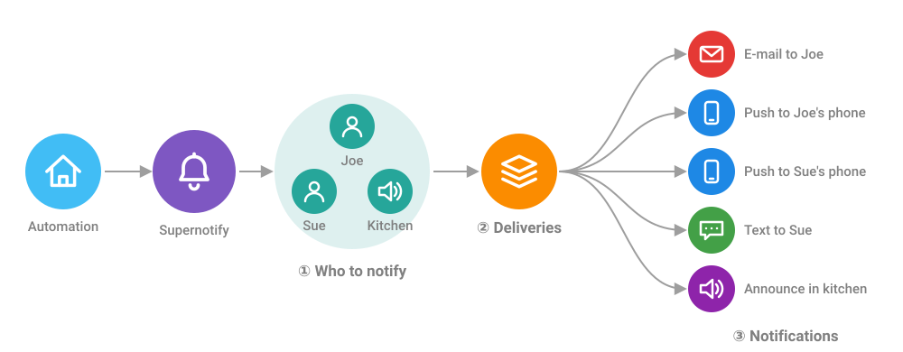

---
tags:
  - transport
  - delivery
  - scenario
  - target
  - recipient
  - principles
description: Core Concepts of Supernotify for Home Assistant, including Transport, Delivery, Scenario and Recipient
---
# Core Concepts

## How It Fits Together

One notification from an automation can turn into several different notifications, each one shaped for the
way it's sent.

1. **Targets** - people are turned into the ways they can be reached, using their [Recipient](#recipient) details
2. **Deliveries** - the [Deliveries](#delivery) that apply are chosen, by default or by [Scenarios](#scenario)
3. **Notifications** - each delivery picks out the targets it can use, and sends a notification suited to it,
   so an e-mail can have a full HTML layout and pictures, while the kitchen speaker gets a short spoken message

## Target
- Who or what gets notified and how
  - *Direct* targets
    - e-mail address
    - phone number
    - `entity_id` or `device_id`, for example to make announcement via Alexa device
    - a custom ID for a specialist transport like Telegram
  - *Indirect* targets, which can be turned into direct targets
    - `person_id` to use the *Recipient* features
    - standard Home Assistant target selectors, `label_id`,`floor_id` and `area_id`.
    - *Group* targets (both new and old style Home Assistant groups)
- Targets can be qualified for a specific **Target Category**, like `discord_channel:839439434`, see [Category Prefixes](usage/targets.md#category-prefixes) for more info.
- Targets are picked off the list by notifications by the best integration to handle it.
  - For example, a Notify Entity on Alexa Devices will be handled by the Alexa Devices transport whereas a generic Notify Entity would fall back to the less capable Notify Entity transport.
- See [Targets](./usage/targets.md) for more information

## Recipient
- A person, with optional e-mail address, phone number, mobile devices or custom targets.
  - By default auto-discovered from the User accounts and Person entities already on Home Assistant
- This makes it easier to refer to people in automations, use `person.joe_mctest` rather than trying to remember Joe's email address in every automation notification. Also works for phone numbers if compatible SMS integration installed, or custom identifiers like Telegram or Discord.
- Each recipient also has a Home Assistant `switch` entity, so it's easy to stop someone being bothered by notifications
- See [People](configuration/people.md) and [Recipes](recipes/index.md) for more detail

## Transport

- *Transport* is the technical means to actually notify, usually by using one of the already installed Home Assistant integrations.
- *Transport Adaptors* are what make the difference between regular Notify Groups and Supernotify.
  - While a Notify Group seems to allow easy multi-channel notifications, in practice each notify transport has different `data` (and `data` inside `data`!) structures, addressing etc so in the end notifications have to be simplified to the lowest common set of attributes, like just `message`!
- Supernotify comes out the box with adaptors for common transports, like e-mail, mobile push, SMS, and Alexa, and a *Generic* transport adaptor that can be used to wrap any other Home Assistant action
- The transport adaptor allows a single notification to be sent to many platforms, even when they all have different and mutually incompatible interfaces.
- They adapt notifications to the transport, pruning out attributes they can't accept, reshaping `data` structures, selecting just the appropriate targets, and allowing additional fine-tuning where it's possible.
- Each transport has a default configuration, which allows lots of fine tuning and defaults to be made, saving need to add the same values into every notification.
- See [Transports](transports/index.md) for more detail

## Delivery

- A **Delivery** defines each notification channel you want to use
  - Out of the box, every Transport has a Delivery with the same name, for example `email` or `mobile_push`.
  - Some transports will auto create additional deliveries, like `alexa_devices_announce_all` or `chime_siren_all`
  - Using YAML more deliveries can be created, for example `html_email` in addition to plain text `email`, or different deliveries for particular voice assistants.
- Transports which can definitively select targets, like Email, Mobile Push, SMS, Alexa Devices and Notify Entity, are included by default in handling targets.
  - Others can be included via configuration, by using Scenarios or asking for them to be included in a notification
- You can define your own deliveries, with a name of your choosing, and have multiple deliveries for a single transport, for example a `plain_email` and `html_email` deliveries.
- The [Generic Transport](transports/generic.md) acts as a *toolbox* for creating a delivery for almost anything Home Assistant could do that's not already covered by a standard Transport
- See [Deliveries](configuration/deliveries.md) and [Recipes](recipes/index.md) for more detail

## Scenario
- A package of settings that can be switched on by name, or automatically by Home Assistant conditions.
- Scenarios can be manually selected, in an `apply_scenarios` value of notification `data` block, or automatically selected using a standard Home Assistant `conditions` block.
  - Conditions include the text of the message, so a Frigate notification about birds on the patio could be notified differently than a prowler at a window
- Use scenarios to make notifications less obtrusive at night, or more festive on holidays, or prioritize some messages
- They make it easy to apply overrides in one place to many different deliveries or notifications, and are the key to making notification calls in your automations radically simpler
- See [Scenarios](configuration/scenarios.md) and [Recipes](recipes/index.md) for more detail

## Priority
- An urgency level for notifications
   - There is no standard way to prioritize notifications, within or outside Home Assistant
   - Supernotify has its own 5 level scheme, which follows the most common practices, from `minimum` to `critical`
   - Priority can be used for things like scenario and delivery rules, and passed onto notify integrations that support it
   - Supernotify has its own e-mail integration, which will translate priority into a way Outlook, Apple Mail etc can understand

!!! info
    For the technically minded, there's a [Class Diagram](developer/class_diagram.md) of the core classes matching these concepts.

# Core Principles

1. All a notification needs is a message, everything else can be defaulted, including all the targets
2. If you define something in an action call, it takes precedence over the defaults
   - This can be tuned by things like `target_usage`
   - The people registry is only used to generate targets if no targets given
3. Action > Scenario > Delivery > Transport for configuration and defaults
4. As unfussy as possible about how it is configured and called
   - Targets can be structured into sub-categories, or a big list of entity ids, device ids, emails and phone numbers
   - Action `data` options like `delivery` can be a single value, list or dictionary mapping

## Developers

See [Developer Concepts](developer/concepts.md) for how notifications flow through deliveries, targets and *Envelopes*, and the [Design Principles](developer/design/principles.md).
