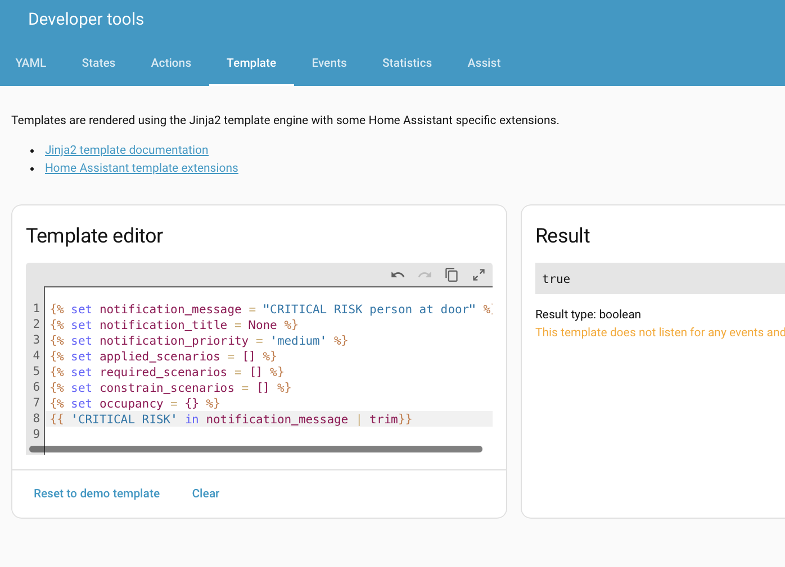

---
tags:
  - condition
  - template
---
# Conditions

The [Bedtime](../recipes/bedtime.md) recipe illustrates a simple use of conditions, based on time of day, and [Seasonal Greetings](../recipes/seasonal_greetings.md) shows a slightly more complex version with `or` logic for date ranges. These conditions are identical to what can be used in any Home Assistant automation.


## Condition Variables

`Scenario` and `Transport` conditions have access to everything that any other Home Assistant conditions can access, such as entities, templating etc. In addition, Supernotify makes additional variables
automatically available:

| Template Variable     | Description                                                        | Default  |
|-----------------------|--------------------------------------------------------------------|----------|
| notification_priority | Priority of current notification, explicitly selected or default   | `medium` |
| notification_message  | Message of current notification                                    | *None*   |
| notification_title    | Title of current notification                                      | *None*   |
| applied_scenarios     | Scenarios explicitly selected in current notification call         | `[]`     |
| required_scenarios    | Scenarios a notification mandates to be enabled or else suppressed | `[]`     |
| constrain_scenarios   | Restricted list of scenarios                                       | `[]`     |
| occupancy             | One or more occupancy states, e.g. ALL_HOME, LONE_HOME             | `{}`     |

These recipes demonstrate how the template variables can be used:

* [Content Escalation](../recipes/content_escalation.md)
* [Alexa Whisper](../recipes/alexa_whisper.md)
* [Except Scenario](../recipes/except_scenario.md)

Be aware of values that can be empty, and which can trip Jinja2 up with some checks. For example `{{ 'CRITICAL' in notification_title}}` will fail with a "not iterable" error if title is not set, which will be the case when the condition is validated at start up or if no title passed on a notification. This can be easily addressed with a filter, such as `{{ 'CRITICAL' in notification_title | trim}}`, or the `upper`,`lower` filters if checking for case.

## Debugging Conditions

The [Developer Tools Template Tab](https://www.home-assistant.io/docs/tools/dev-tools/#template-editor-tab)
is the best place to quickly check that a template will do what you want. Use this initial block to
populate all the Supernotify condition variables, and set up the test values:

```jinja2







```



## References

* [Home Assistant Conditions](https://www.home-assistant.io/docs/scripts/conditions/)
* [Jinja2 Template Documentation](https://jinja.palletsprojects.com/en/latest/templates/)
* [Home Assistant Template Extensions](https://www.home-assistant.io/docs/configuration/templating/#home-assistant-template-extensions)
