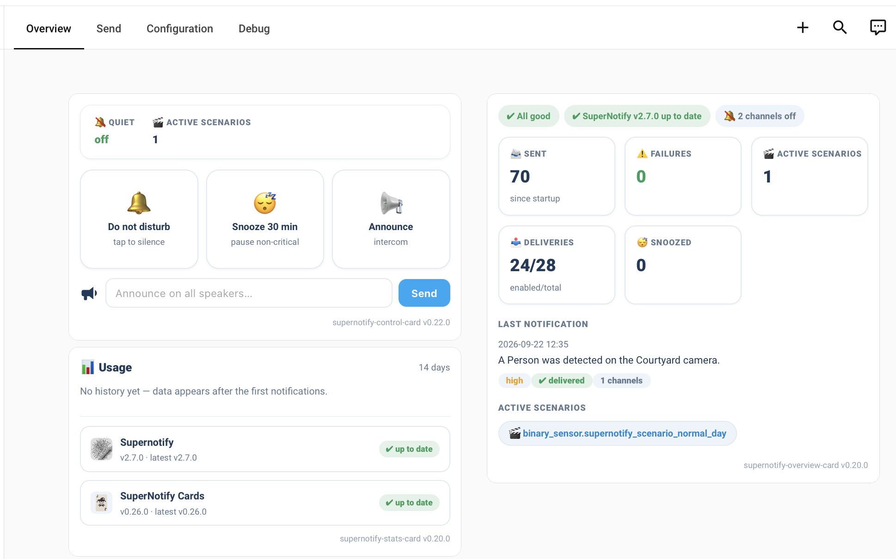

# Dashboard

Create a dashboard to use, configure and debug notifications using [Supernotify Cards](https://github.com/lollox80/supernotify-cards/blob/main/README.md)



## Configuration

```yaml title="Example Dashboard"
views:
  - type: sections
    max_columns: 4
    title: Overview
    path: overview
    sections:
      - type: grid
        cards:
          - type: heading
            heading_style: title
          - type: custom:supernotify-control-card
            dnd_entity: input_boolean.notifier_dnd
            snooze_minutes: 30
            tiles:
              - dnd
              - snooze
              - announce
            groups: []
          - type: custom:supernotify-stats-card
            days: 14
      - type: grid
        cards:
          - type: heading
            heading_style: title
          - type: custom:supernotify-overview-card
            poll_seconds: 60
  - type: sections
    sections:
      - type: grid
        cards:
          - type: heading
            heading: Send a Notification
            heading_style: title
            icon: mdi:message-text-fast-outline
          - type: custom:supernotify-composer-card
    header:
      card:
        type: markdown
        text_only: true
        content: '# Supernotify'
    max_columns: 4
    title: Send
    cards: []
  - type: masonry
    path: configuration
    title: Configuration
    cards:
      - type: custom:supernotify-recipients-card
      - type: custom:supernotify-transports-card
      - type: custom:supernotify-deliveries-card
        hide_defaults: true
      - type: custom:supernotify-scenarios-card
  - type: masonry
    path: debug
    title: Debug
    cards:
      - type: markdown
        content: >-
          

          - [Supernotify
          Documentation](https://supernotify.rhizomatics.org.uk/latest/)

          - [What's
          New](https://supernotify.rhizomatics.org.uk/latest/changelog/)

          - [Supernotify
          Cards](https://github.com/lollox80/supernotify-cards/blob/main/README.md)

          - [Recipes](https://supernotify.rhizomatics.org.uk/latest/recipes/)
      - type: tile
        entity: update.supernotify_update
        features:
          - type: update-actions
      - type: custom:supernotify-simulator-card
      - type: custom:supernotify-archive-card
        entity: sensor.supernotify_archivio
      - type: custom:supernotify-automations-card
```
