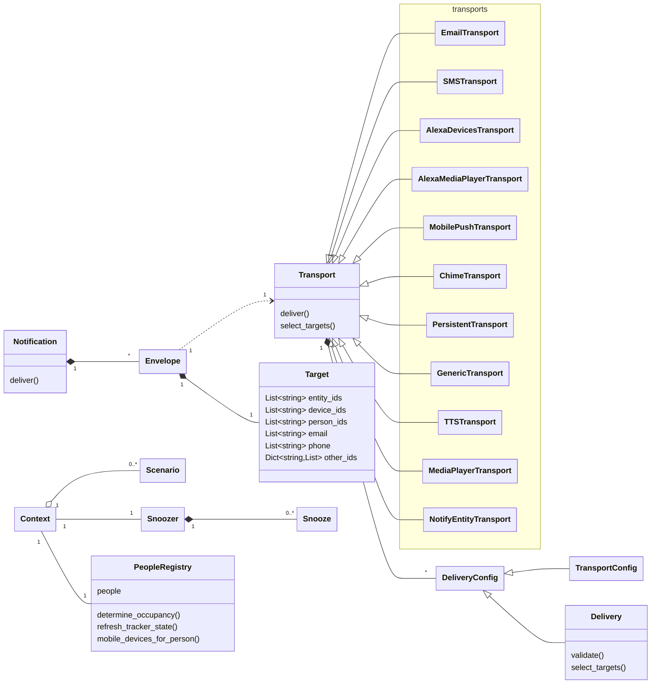

---
tags:
  - developer
  - classes
description: Class Diagram for the core classes of Supernotify for Home Assistant
---
# Simplified Class Diagram

```mermaid
---
  config:
    class:
      hideEmptyMembersBox: true
---
classDiagram
direction LR
    class Notification {
         deliver()
    }
    class Envelope {
    }
    class Transport {
        deliver()
        select_targets()
    }
    class TransportConfig {
    }
    class Target {
        List~string~ entity_ids
        List~string~ device_ids
        List~string~ person_ids
        List~string~ email
        List~string~ phone
        Dict~string,List~ other_ids
    }
    class Delivery{
        validate()
        select_targets()
    }
    class DeliveryConfig {
    }
    class Context {
    }
    class Scenario {
    }
    class Snoozer {
    }
    class Snooze {
    }
    class PeopleRegistry {
        people
        determine_occupancy()
        refresh_tracker_state()
        mobile_devices_for_person()
    }
    namespace transports {
        class EmailTransport{}
        class SMSTransport{}
        class AlexaDevicesTransport{}
        class AlexaMediaPlayerTransport{}
        class MobilePushTransport{}
        class ChimeTransport{}
        class PersistentTransport{}
        class GenericTransport{}
        class TTSTransport{}
        class MediaPlayerTransport{}
        class NotifyEntityTransport{}
    }

    Notification "1" *-- "*" Envelope
    Envelope "1" ..> "1" Transport
    Envelope "1" *-- "1" Target
    Transport "1" *-- "*" DeliveryConfig
    Context "1" o-- "0..*" Scenario
    Snoozer "1" *-- "0..*" Snooze
    Context "1" -- "1" Snoozer
    Context "1" -- "1" PeopleRegistry
    DeliveryConfig <|-- TransportConfig
    DeliveryConfig <|-- Delivery
    Transport <|--  EmailTransport
    Transport <|--  SMSTransport
    Transport <|--  AlexaDevicesTransport
    Transport <|--  AlexaMediaPlayerTransport
    Transport <|--  MobilePushTransport
    Transport <|--  ChimeTransport
    Transport <|--  PersistentTransport
    Transport <|--  GenericTransport
    Transport <|--  TTSTransport
    Transport <|--  MediaPlayerTransport
    Transport <|--  NotifyEntityTransport
```
