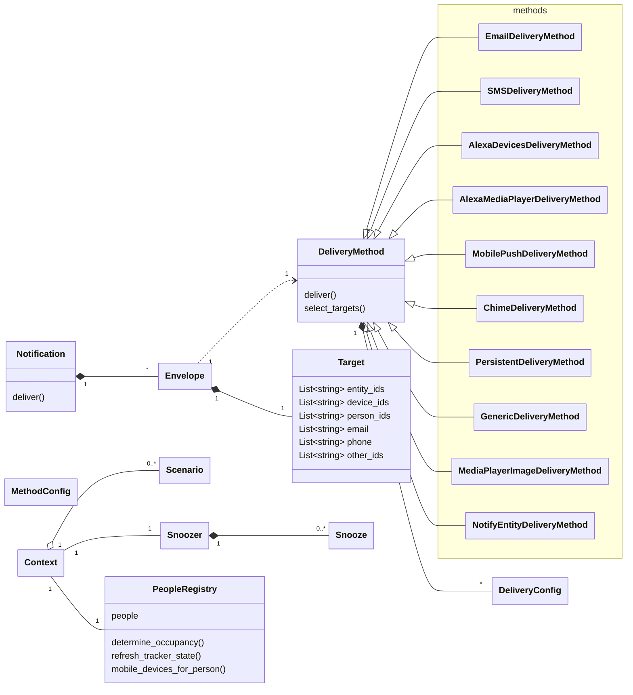

# Simplified Class Diagram

```mermaid
---
  config:
    class:
      hideEmptyMembersBox: true
---
classDiagram
direction LR
    class Notification {
         deliver()
    }
    class Envelope {
    }
    class DeliveryMethod {
        deliver()
        select_targets()
    }
    class MethodConfig {
    }
    class Target {
        List~string~ entity_ids
        List~string~ device_ids
        List~string~ person_ids
        List~string~ email
        List~string~ phone
        List~string~ other_ids
    }
    class DeliveryConfig {
    }
    class Context {
    }
    class Scenario {
    }
    class Snoozer {
    }
    class Snooze {
    }
    class PeopleRegistry {
        people
        determine_occupancy()
        refresh_tracker_state()
        mobile_devices_for_person()
    }
    namespace methods {
        class EmailDeliveryMethod{}
        class SMSDeliveryMethod{}
        class AlexaDevicesDeliveryMethod{}
        class AlexaMediaPlayerDeliveryMethod{}
        class MobilePushDeliveryMethod{}
        class ChimeDeliveryMethod{}
        class PersistentDeliveryMethod{}
        class GenericDeliveryMethod{}
        class MediaPlayerImageDeliveryMethod{}
        class NotifyEntityDeliveryMethod{}
    }

    Notification "1" *-- "*" Envelope
    Envelope "1" ..> "1" DeliveryMethod
    Envelope "1" *-- "1" Target
    DeliveryMethod "1" *-- "*" DeliveryConfig
    Context "1" o-- "0..*" Scenario
    Snoozer "1" *-- "0..*" Snooze
    Context "1" -- "1" Snoozer
    Context "1" -- "1" PeopleRegistry
    DeliveryMethod <|--  EmailDeliveryMethod
    DeliveryMethod <|--  SMSDeliveryMethod
    DeliveryMethod <|--  AlexaDevicesDeliveryMethod
    DeliveryMethod <|--  AlexaMediaPlayerDeliveryMethod
    DeliveryMethod <|--  MobilePushDeliveryMethod
    DeliveryMethod <|--  ChimeDeliveryMethod
    DeliveryMethod <|--  PersistentDeliveryMethod
    DeliveryMethod <|--  GenericDeliveryMethod
    DeliveryMethod <|--  MediaPlayerImageDeliveryMethod
    DeliveryMethod <|--  NotifyEntityDeliveryMethod
```
