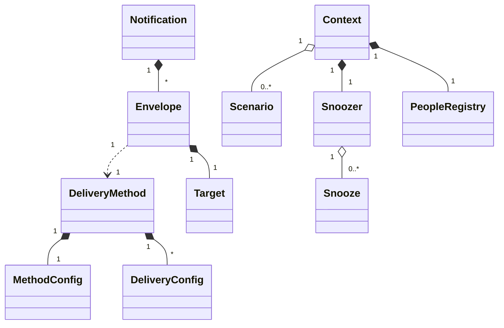

# Core Classes

::: custom_components.supernotify.delivery_method.DeliveryMethod
    handler: python
    heading_level: 2

::: custom_components.supernotify.notification.Notification
    handler: python
    heading_level: 2

::: custom_components.supernotify.envelope.Envelope
    handler: python
    heading_level: 2

::: custom_components.supernotify.scenario.Scenario
    handler: python
    heading_level: 2

::: custom_components.supernotify.model.Target
    handler: python
    heading_level: 2

::: custom_components.supernotify.model.DeliveryConfig
    handler: python
    heading_level: 2

::: custom_components.supernotify.model.MethodConfig
    handler: python
    heading_level: 2

::: custom_components.supernotify.snoozer.Snooze
    handler: python
    heading_level: 2

::: custom_components.supernotify.model.ConditionVariables
    handler: python
    heading_level: 2

::: custom_components.supernotify.people.PeopleRegistry
    handler: python
    heading_level: 2