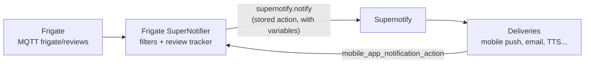

# Frigate SuperNotifier

The first [Package](./packages.md): a new module (with optional separate HACS custom component for visibility) that replaces the
[Frigate Notifications blueprint](https://github.com/SgtBatten/HA_blueprints/tree/main/Frigate_Camera_Notifications)
(beta `0.14.0.3l`) for review events, sending everything through Supernotify.

## Goals

- 100% ConfigFlow, no YAML needed to set up or use
- Sensible defaults, so a user only picks cameras and gets working mobile, email and voice notifications
- Every part of the `supernotify.notify` call can still be tuned, using the same UI as an automation action
- Supernotify's own YAML still applies, so users can add scenarios or deliveries that react to Frigate notifications
- The [Apple push fix](../../recipes/fix_frigate_apple_push.md) is built in, with an option to turn it off

Out of scope for the first release: GenAI review summaries (`frigate/tracked_object_update` and the `genai` review type),
ANPR, Telegram inline keyboards and Android TV overlays. Telegram and TV remain possible as ordinary Supernotify deliveries.

## Architecture

- **Package module inside Supernotify**, with `mqtt` and `frigate` as `after_dependencies`, only offered when both are
  loaded. A thin *Frigate SuperNotifier* HACS repository can follow later for visibility
- **Config subentry per notification profile** of the Supernotify entry - a Frigate instance and a set of cameras with
  their own filters and notification. Most users have one; someone wanting the driveway treated differently from the
  garden adds a second
- **Frigate settings discovered** from the existing `frigate` config entry. The MQTT topic prefix, proxy client ID and
  base URL are read from the Frigate entry and Home Assistant's external URL, replacing the blueprint's `base_url`,
  `client_id` and `mqtt_topic` inputs
- **Runtime**: one MQTT subscription per entry; a review tracker keeps per-review state (severity, objects,
  sub-labels, zones, last sent) in memory, replacing the blueprint's `wait_for_trigger` loop. Everything is in code,
  so improvements reach existing users on upgrade

## Customization UI

HA integration config flows can't show an automation editor in general, but they can show the **action selector**.
Core already does this, for example the Template helper's alarm panel uses `ActionSelector` for its arm and disarm
actions (`homeassistant/components/template/config_flow.py`).

So each profile stores its notification as an action:

- The **Notification** step of the subentry flow shows an `ActionSelector`, pre-filled with a
  `supernotify.notify` call using the default title, message, media, priority and actions
- The user sees exactly the `supernotify.notify` UI they'd get in an automation, and can change any field, add
  `delivery` overrides, `apply_scenarios`, or even add further actions before or after
- The component runs the stored actions with `homeassistant.helpers.script.Script`, passing the review as variables,
  so templates like `{{ label }}` work as they do in the blueprint
- A **Reset to default** option replaces the stored action with the current default, for when the default improves

Variables passed to the action:

| Variable                                       | Meaning                                                                     |
| ---------------------------------------------- | --------------------------------------------------------------------------- |
| `camera`, `camera_name`, `camera_entity_id`    | Frigate camera name, title-cased name, and its HA camera entity             |
| `label`, `objects`, `sub_labels`               | Formatted label (with sub-labels merged, as the blueprint does), raw lists  |
| `zones`, `severity`, `review_id`, `detection_id` | From the review payload                                                   |
| `snapshot_url`, `thumbnail_url`, `clip_url`, `hls_url`, `review_url` | Pre-built proxy URLs, so users don't need to know the API paths |
| `is_update`, `is_final`, `update_reason`       | Whether this is a follow-up for the same review, and why it was sent        |

Filters stay as structured fields, not templates:

| Blueprint input                                   | Profile setting                                                         |
| ------------------------------------------------- | ----------------------------------------------------------------------- |
| `camera`                                          | Multi-select of Frigate cameras                                          |
| `review_severity`                                 | Alert / detection                                                        |
| `labels`, `zones`, `zone_multi`, `zone_order_enforced` | Selects populated from the Frigate config for the chosen cameras     |
| `presence_filter`                                 | Person/zone entity select - or leave to Supernotify occupancy scenarios |
| `state_filter`, `state_entity`, `state_filter_states`, `disable_times`, `master_condition`, `custom_filter` | One `ConditionSelector`, pre-filled empty |
| `cooldown`, `timeout`, `initial_delay`, `final_delay`, `final_update`, `alert_once` | Number and boolean fields in an *Advanced* section   |
| `update_sub_label`                                | Boolean                                                                  |

Delivery-level inputs from the blueprint are **not** profile settings, because Supernotify already owns them:

| Blueprint input                                   | Where it lives instead                                                   |
| ------------------------------------------------- | ----------------------------------------------------------------------- |
| `notify_device`, `notify_group`                   | Supernotify recipients and mobile push delivery - fixes the blueprint's notify group problems |
| `critical`, `interruption_level`, `sound`, `volume` | `priority` in the action, mapped by the mobile push transport            |
| `color`, `icon`, `sticky`, `channel`, `android_auto`, `subtitle` | `extra_data` in the action; `mobile_push_*` options where they exist |
| `group`, `tag`                                    | Set by the component from camera and review ID                          |
| `attachment`, `attachment_2`, `video`, `ios_live_view` | `media` in the action (`snapshot_url`, `clip_url`, `camera_entity_id`) |
| `tap_action`, `button_1..3`, `url_1..3`, `icon_1..3` | `actions` in the action, default *View Clip* and *View Snapshot*       |
| `button_3` silence, `silence_timer`               | Supernotify's own camera snooze action                                   |
| `tts`, `tts_helper`                               | A TTS delivery, or `mobile_push_tts_text`; dedupe per review is component state |
| `custom_action_manual`, `custom_action_auto(_multi)` | Extra actions in the stored action sequence; manual ones via a component action button |
| `telegram_*`, `tv_*`                              | Ordinary Supernotify deliveries, later                                   |
| `debug`, `redacted`                               | Supernotify archive and debug trace                                      |

Remaining profile settings, with the fix recipe:

- **Apple-compatible video links** (default on) - Apple devices get the HLS `master.m3u8` link and no `clip.mp4`
  attachment or `clickAction`, as in the [recipe](../../recipes/fix_frigate_apple_push.md). Off sends the same links to
  every device, as the blueprint does

## Changes needed in Supernotify

### For packages in general

1. **Notification source** - a `source` field on `supernotify.notify` (for example `frigate:driveway`), carried into the
   archive, the debug trace and scenario condition variables, so users can write scenarios that only apply to Frigate,
   or one camera
2. **Updates to an existing notification** - promote `mobile_push_notification_tag` to a transport-neutral
   notification `tag`, plus an `update` flag meaning *replace, and don't alert again*. Transports then decide: mobile
   push replaces silently, email and TTS skip updates by default. Duplicate checking must not suppress an update of
   the same tag
3. **Cooldown / rate limiting per source** - the blueprint's `cooldown`; overlaps the Rate Limiting roadmap item
4. **Snooze enforcement** - `SUPERNOTIFY_SNOOZE_EVERYONE_CAMERA_*` snoozes are recorded but appear not to be applied:
   `Snoozer.is_global_snooze()` only checks `EVERYTHING` and `NONCRITICAL`, and `filter_recipients()` only acts on
   user-scoped snoozes. The camera snooze button on every camera push, and everyone-scoped delivery, transport and
   priority snoozes, need a regression test and fix. Camera snoozes also need the notification's camera to compare with
5. **Richer `services.yaml`** - the action editor is the whole customization UI, so field descriptions, examples and
   dynamic delivery and scenario dropdowns (via `async_set_service_schema`) matter far more than today
6. **Stable config for packages** - packages need to find existing deliveries and recipients (for example to warn if
   there's no mobile push delivery); `enquire_*` actions cover most of this, but a small Python API on the Supernotify
   config entry would be cleaner

### Mobile push gaps

7. **Media precedence** - if a notification has both `camera_entity_id` and `snapshot_url`, today the camera grab wins.
   Frigate needs the snapshot URL for the image and the camera entity only for iOS live view, grouping and snoozing
8. **iOS video attachment** - `clip_url` only becomes Android's `video`. Add the iOS `attachment` with `url` and
   `content-type` derived from the URL (`application/vnd.apple.mpegurl` for `.m3u8`), which is where the Apple fix option
   plugs in
9. **Tap URL** - no cross-platform field for tapping the notification (iOS `url`, Android `clickAction`); today it only
   works as passthrough `extra_data`, which can't differ per platform
10. **Silent updates** - map an update to iOS `sound: none` with `passive` interruption level and Android
    `alert_once: true`, rather than needing a separate priority
11. **Live view entity** - allow iOS `entity_id` (live camera view) to be set independently of the image source

## Open Questions

- Spike: confirm `ActionSelector` defaults render pre-filled in a subentry flow, and that templates in `data` survive
  storage and run through `Script` with the review variables
- Spike: confirm `ConditionSelector` renders in config flows, since no core integration uses it there yet
- How does the component know Frigate's camera list, zones and labels during the flow - from the Frigate integration's
  coordinator data, or the Frigate API?
- Should a default profile be created automatically when a Frigate entry is found, or only offered?
- Naming - see [Packages](./packages.md#questions)
