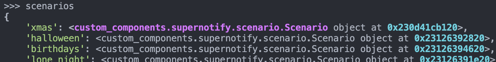

---
tags:
  - developer
  - debugging
  - ha-repl
  - repl
description: Using the ha-repl developer shell and its Supernotify plugin to inspect a running Supernotify
---
# Developer Shell

[Home Assistant REPL](https://homeassistant-repl.rhizomatics.org.uk) (`ha-repl`) runs Python against a running Home Assistant, either at an interactive prompt or one snippet at a time. This repository carries a plugin for it, which puts the live Supernotify objects - the engine, registries, deliveries, scenarios and recipients - at the prompt as ordinary variables.

It is for checking how Supernotify really behaves on a running instance, where the alternative is reading the source and guessing, or adding log lines and restarting.

!!! warning
    In live and exec modes, whatever is typed runs inside Home Assistant, with everything that the `hass` object can reach. Use a development instance or devcontainer unless you are sure of what a statement does.



## ha-repl Documentation

Only what is particular to Supernotify is covered here, the rest is in the `ha-repl` documentation:

| Page                                                                                                         | Covers                                                                    |
|--------------------------------------------------------------------------------------------------------------|---------------------------------------------------------------------------|
| [Home](https://homeassistant-repl.rhizomatics.org.uk)                                                        | Installation, connecting to a server, the `ha_repl_server` component      |
| [Live mode](https://homeassistant-repl.rhizomatics.org.uk/modes/live_mode/)                                  | The interactive shell, and what runs locally and what inside Home Assistant |
| [Exec mode](https://homeassistant-repl.rhizomatics.org.uk/modes/exec_mode/)                                  | One-shot snippets, JSON output and exit status, for scripts and AI agents |
| [Object tree](https://homeassistant-repl.rhizomatics.org.uk/obj_tree/)                                       | Finding entities with `obj`, by path, domain, platform, area or label     |
| [SQL access](https://homeassistant-repl.rhizomatics.org.uk/sql/)                                             | Querying the recorder database with `sql`                                 |
| [Library use](https://homeassistant-repl.rhizomatics.org.uk/configuration/alternative_integration/)          | Using it from plain Python, ipython or Marimo                             |

The whole of it is also available as a single Markdown file for AI agents, at [llms-full.txt](https://homeassistant-repl.rhizomatics.org.uk/llms-full.txt).

## Set Up

1. `homeassistant_repl` is one of the development dependencies, so after `uv sync` it runs as `uv run ha-repl`. It needs Python 3.14.
2. Set `HASS_SERVER` and `HASS_TOKEN`, in the environment or a `.env` file in the repository root, or name a server in `~/.config/ha-repl/config.toml`. `ha-repl servers` lists what is configured.
3. For live and exec modes, install the `ha_repl_server` custom component on the Home Assistant instance, at the same version as the `ha-repl` client. API mode works without it.
4. Run `ha-repl trust` in the repository root.

The last step is needed because the plugin is code that runs at the start of every session, so `ha-repl` ignores a repository's `.ha-repl` directory until it has been approved. The approval is for the files as they were at the time, so it has to be given again whenever the plugin changes, including after pulling a change to it. Until then `ha-repl` starts with a warning and without the Supernotify variables.

## What the Plugin Offers

The plugin is a single file, `.ha-repl/plugins/10-supernotify-internals.py`. Nothing in it is imported on your own machine: the block that uses `hass` is sent to Home Assistant and run there, and the names it defines are then used from the prompt as if they were local.

| Name                | What it is                                                                   | Modes      |
|---------------------|------------------------------------------------------------------------------|------------|
| `engine`            | The `SupernotifyEngine` behind the config entry                              | live, exec |
| `deliveries`        | Dict of `Delivery` by name, from the delivery registry                       | live, exec |
| `scenarios`         | Dict of `Scenario` by name, from the scenario registry                       | live, exec |
| `people`            | Dict of `Recipient` by `person` entity id, from the people registry          | live, exec |
| `archive`           | The `NotificationArchive`                                                    | live, exec |
| `sn_dr`, `sn_sr`, `sn_pr` | The `DeliveryRegistry`, `ScenarioRegistry` and `PeopleRegistry` themselves | live, exec |
| `sn_ce`             | The Supernotify config entry                                                 | live, exec |
| `sn_yaml`           | Whatever is under `hass.data["supernotify"]`                                 | live, exec |
| `switches`          | Supernotify's `switch` entities, found with `obj`                            | all        |
| `binary_sensors`    | Supernotify's `binary_sensor` entities, found with `obj`                     | all        |

In API mode, which is what plain `ha-repl` starts, only the last two are defined, since there is no `hass` to reach the others through.

The most recent `Notification` is at `engine.last_notification`.

The classes are described in [Classes](reference/classes/index.md), and how they fit together in [Concepts](concepts.md).

## Using It

### Interactive

```bash
uv run ha-repl live
```

```python
>>> list(deliveries)
>>> {name: d.transport.name for name, d in sn_dr.enabled_deliveries.items()}
>>> scenarios["red_alert"].attributes()
>>> engine.sent, engine.failures
>>> help(engine)
```

`help(thing)` prints a short summary of an object's methods and properties, which is a quick way round an unfamiliar class.

### One Snippet

`exec` runs a snippet and exits, which suits scripts, and is what an AI coding agent uses:

```bash
uv run ha-repl --json exec -t 30 - <<'PY'
{name: (d.last_outcome, d.last_skip_reason) for name, d in deliveries.items()}
PY
```

Objects stay inside Home Assistant and only plain data comes back - strings, numbers, lists and dicts - so shape the last expression that way. Anything else is returned as its `repr()`.

### With Claude Code

The `ha-repl` project publishes a Claude Code plugin in the [Rhizomatics plugin marketplace](https://github.com/rhizomatics/agent-plugins), with a skill that teaches the agent to use `exec` mode:

```bash
claude plugin marketplace add rhizomatics/agent-plugins
claude plugin install homeassistant-repl@rhizomatics
```

Installing it for other agents is covered under [Agent Skill](https://homeassistant-repl.rhizomatics.org.uk/modes/exec_mode/#agent-skill) in the `ha-repl` documentation.

With that installed and this repository trusted, the agent can be asked to check something against the running instance and has the same Supernotify variables to do it with. It will not run `ha-repl trust` itself, since that approves code to run.

## Suggestions

Why a delivery was or wasn't used
:   `deliveries["alexa_announce"].last_outcome` and `last_skip_reason` hold how the last live notification went for it. `engine.last_notification.contents(diagnostics=True)` gives the whole notification as a dict, with the deliveries selected and skipped, the scenarios applied and the envelopes sent.

What configuration ended up as
:   A delivery is built from its own configuration, its transport's defaults and any migration of deprecated options. `deliveries["html_email"].as_dict()` shows the result, and `sn_dr.implicit_deliveries`, `fallback_by_default_deliveries` and `choosable_deliveries` show how the registry has classified them.

Who is home and how they will be reached
:   `sn_pr.determine_occupancy()` gives the recipients by occupancy state, and `people["person.joe_bloggs"].as_dict()` one recipient with their resolved mobile devices and delivery overrides.

Scenario conditions
:   `scenarios["night_time"].attributes(include_trace=True)` gives a scenario's conditions and its last trace, and `sn_sr.scenario_is_on(scenarios["night_time"])` what its binary sensor would report now.

Runtime switches against configuration
:   Deliveries, scenarios and recipients can be switched off at runtime. Compare `d.enabled` with `d.config_enabled`, or look at the entities themselves with `[(s.entity_id, s.state) for s in switches]`.

History
:   The recorder is available through `sql`, so the `supernotification` archive events and the history of Supernotify's sensors can be queried without leaving the shell, and mixed with what the live objects say.

Trying an expression before writing the code
:   When changing how a transport calls another integration, check the real service schema, entity attributes or device registry entries on a live instance first with `hass` and `obj`, in place of working it out from the other integration's source.

Reproducing a support case
:   Call `engine.async_send_message(...)` directly with the message, target and `data` from an issue, then walk the resulting `engine.last_notification`. This sends a real notification, so use it on a development instance.

!!! note
    What the shell shows is one instance's behaviour. It helps find a bug and understand it, and the fix still needs a regression test in the test suite.

## Extending the Plugin

Plugin files in `.ha-repl/plugins` run in name order at the start of each session, so more names can be added to the existing file, or a new file added alongside it for something more specialised. Keep anything personal, such as shortcuts for your own entities, in `~/.config/ha-repl/plugins/`, which is not shared with the repository.
