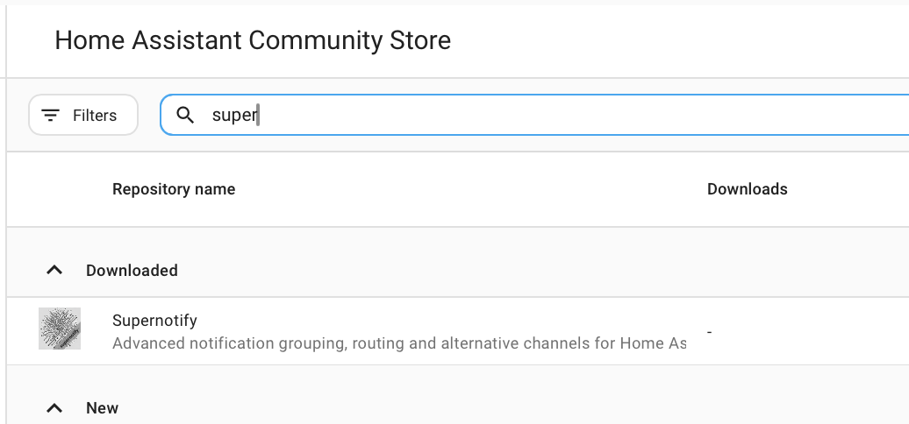
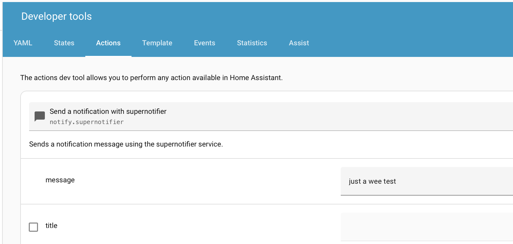

---
tags:
  - installation
  - hacs
  - configuration
  - developer tools
description: Getting Started with Supernotify for Home Assistant
---
# Getting Started

## HACS

Make sure you have **HACS** installed

If not, check the [HACS Instructions](https://hacs.xyz/docs/use/). Supernotify is one of the default repositories in HACS so no custom repo configuration required

## Download

From the HACS page on Home Assistant, select **Supernotify** in the list of available integrations

{width=400}

## Configure

Add Supernotify to the Home Assistant YAML configuration ([YAML Configuration](configuration/yaml.md)).

The [Configuration](configuration/index.md) pages have instructions and examples, including a [minimal](configuration/examples/minimal.md) one that is only two lines of YAML and is good enough to get mobile push notifications working, plus use an
existing SMTP integration if you have it or any notify entities.

```yaml title="All the YAML needed to get started"
notify:
- name: minimal
  platform: supernotify
```

## Send

Send a test notification from [Developer Tools Action Tab](https://www.home-assistant.io/docs/tools/dev-tools/#actions-tab) or start [sending notifications](usage/notifying.md) from automations.

{width=400}

This first notification will go out all mobile devices in the house. To limit it, list the mobile devices, or the `person` entities as targets in the notification:

{width=400}


## Be Inspired

Find lots of ideas with example configuration in the [Recipes](recipes/index.md).
