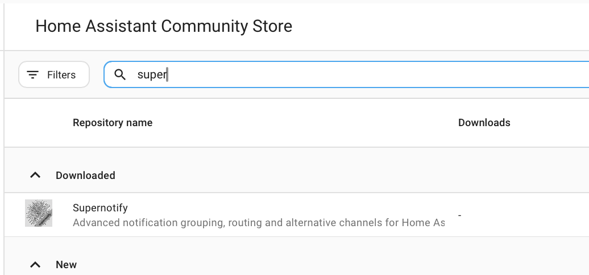
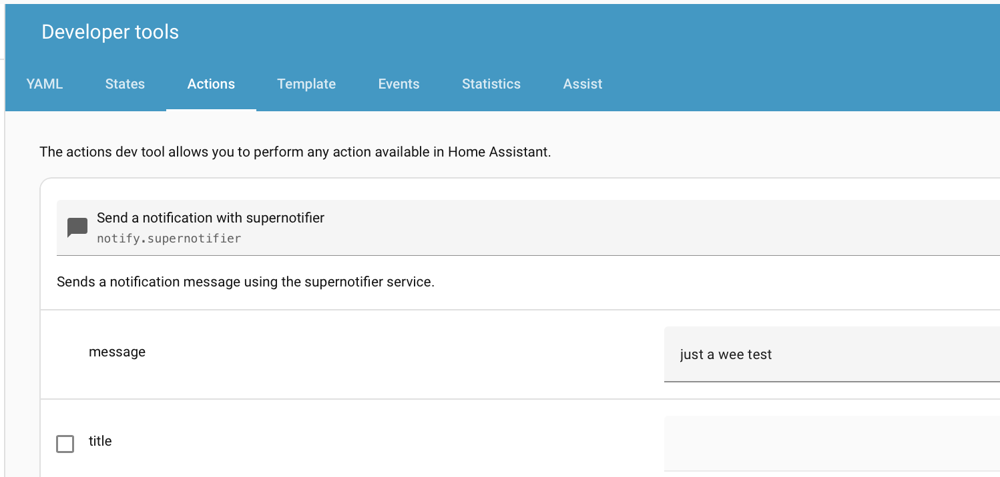
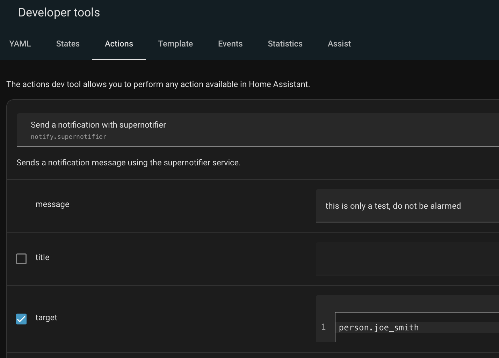
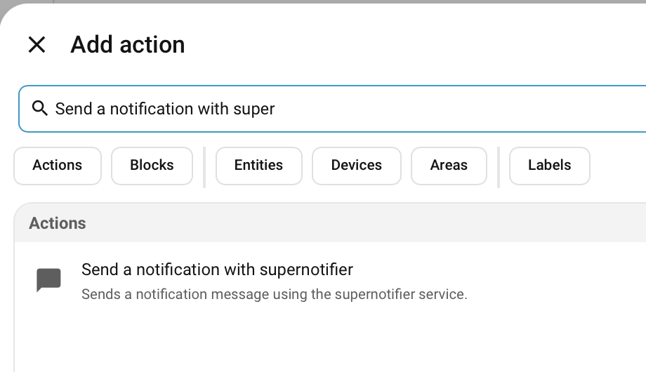
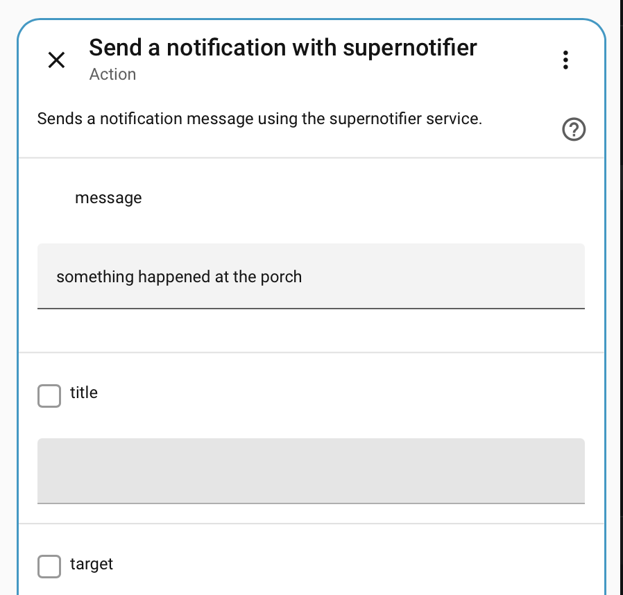

---
tags:
  - installation
  - hacs
  - configuration
  - developer tools
description: Getting Started with Supernotify for Home Assistant
---
# Getting Started

## HACS

Make sure you have **HACS** installed

If not, check the [HACS Instructions](https://hacs.xyz/docs/use/). Supernotify is one of the default repositories in HACS so no custom repo configuration required

## Installation

From the HACS page on Home Assistant, select **Supernotify** in the list of available integrations

{width=400}

## Configure

Supernotify can be set up either from the UI or from YAML.

For a zero-configuration setup with everything auto-discovered (mobile push, an existing SMTP
integration or any notify entities, recipients from Home Assistant persons), go to
**Settings → Devices & Services → Add Integration** and search for **Supernotify**. Archive,
duplicate detection and housekeeping settings can be adjusted afterwards from the integration's
**Configure** option.

Deliveries, transports, scenarios, recipients and cameras are still configured via YAML for
now - see the [Configuration](configuration/index.md) pages.

## Send

Send a test notification from [Developer Tools Action Tab](https://www.home-assistant.io/docs/tools/dev-tools/#actions-tab) or start [sending notifications](usage/notifying.md) from automations.

{width=400}

This first notification will go out all mobile devices in the house. To limit it, list the mobile devices, or the `person` entities as targets in the notification:

{width=400}

### Add a Notification Action to an Automation

{width=400}

{width=400}

## Removal

From the HACS menu, select `Supernotify` and chose `Remove` from the `...` menu.

### Cleaning Up Config

1. Any manually created YAML files in the `config` directory will be untouched, remove these manually if confident they won't be needed again.
2. Any archived notifications will remain, by default in `/config/archive/supernotify` directory unless configured otherwise. Remove this directory if needed.
3. If using cameras or image attachments, media files may be left, by default in `/config/media/supernotify` directory unless configured otherwise. Remove this directory if needed.
4. Templates may be left behind, by default in `/config/templates/supernotify` directory unless configured otherwise. Remove this directory if needed.

## Be Inspired

Find lots of ideas with example configuration in the [Recipes](recipes/index.md).
