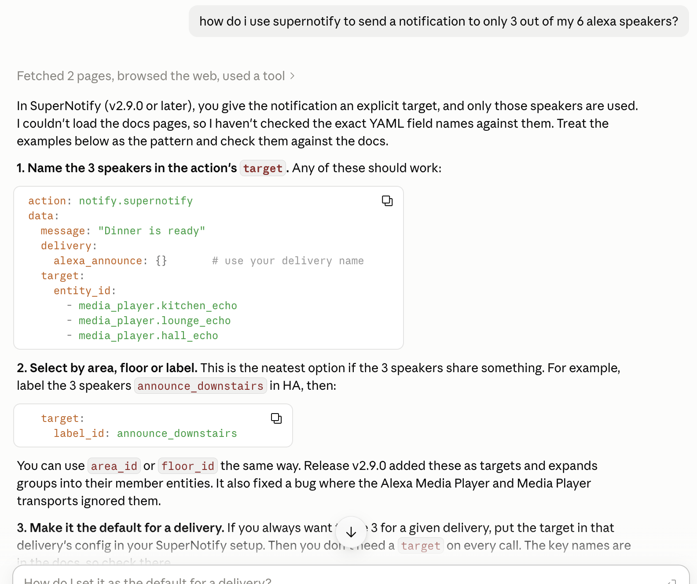
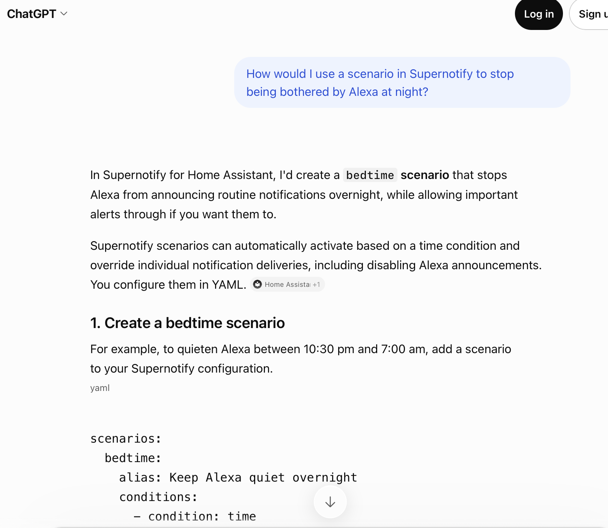
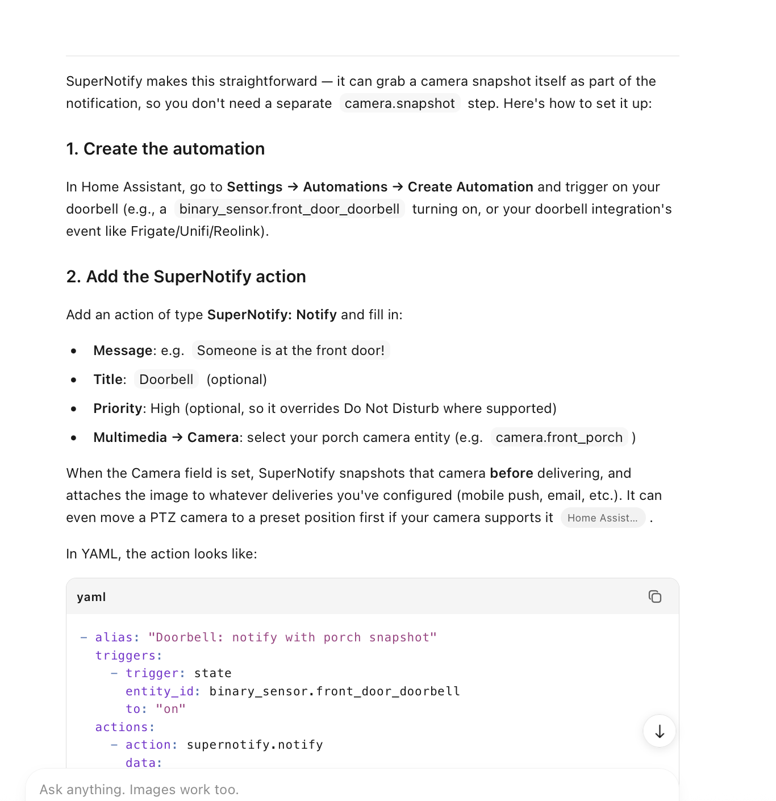

---
tags:
  - ai
  - claude
  - chatgpt
  - kimi
  - agent
  - support
  - help
title: AI Assisted Help
description: Answers to support queries
---
# AI Assisted Help

AI agents, like Claude or ChatGPT, are becoming increasingly better at giving good advice on Supernotify, helped by the documentation being setup to be accessible to them.

They can diagnose issues, suggest how make a notification work how you want, and even write or rewrite entire YAML configs. Its now feasible to have an advanced YAML configuration making your notifications exactly how you like them without having any clue about YAML.

In all the examples below there is no special setup, no skills or other context - they are given a simple prompt as might be the case for a new user.

## Claude Example

In this example, Claude answers one of the FAQs, how to only notify some speakers, and shows how to set up the notification.

{width=700}

## ChatGPT Example

ChatGPT gives decent suggestions, including workable YAML, for a common need to stop Alexa announcement after bedtime. This is a free session, without being logged in.

## Kimi Example

In this example, a free [Kimi](https://kimi.ai) agent gives good advice on how to get a camera snapshot onto porch notifications.

## Assist Bot

The Home Assistant [Assist] chat and voice assistant is much more limited when used without an AI service, though can provide a link to the help pages if you ask it how to get help on Supernotify.
