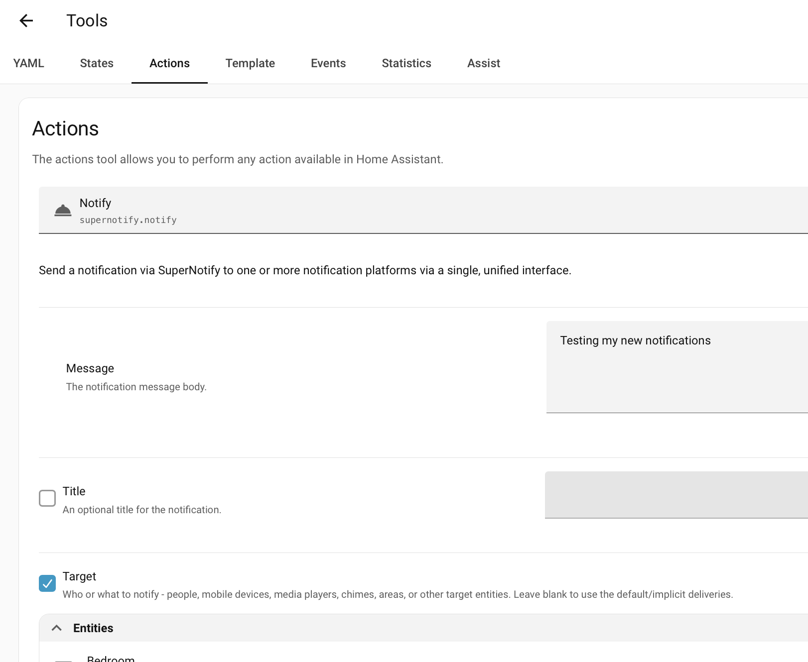
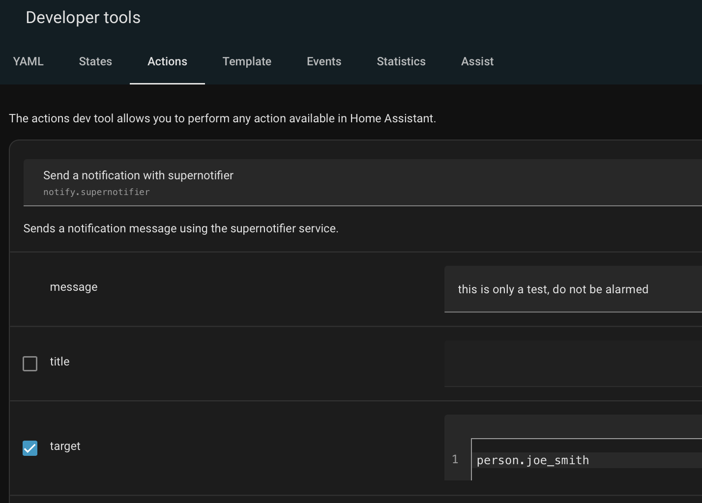
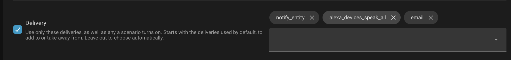

# अपनी पहली सूचना भेजें

इस पेज का सारा काम [इंस्टॉलेशन](installation.md) के ठीक बाद, Home Assistant के UI से होता है। जो लोग YAML पसंद करते हैं, उनके लिए हर चरण में YAML भी दिखाया गया है।

## 1. सभी को सूचित करें { #1-notify-everyone }

**डेवलपर टूल्स** में [Actions टैब](https://www.home-assistant.io/docs/tools/dev-tools/#actions-tab) खोलें, `supernotify.notify` एक्शन चुनें, एक संदेश लिखें और **एक्शन चलाएँ** दबाएँ।

{width=600}

```yaml title="सभी के लिए संदेश"
action: supernotify.notify
data:
  message: Something went off in the basement
```

एक सूचना को बस एक संदेश चाहिए। और कुछ न बताने पर, यह घर के हर व्यक्ति के उन सभी फ़ोन और टैबलेट पर जाती है जिन पर Home Assistant ऐप चल रहा है।

## 2. एक व्यक्ति को सूचित करें { #2-notify-one-person }

शायद यह आपकी ज़रूरत से ज़्यादा लोग हैं। इसे सीमित करने के लिए `person` एंटिटी, या अलग-अलग मोबाइल डिवाइस, को **लक्ष्य** (target) के रूप में चुनें।

{width=400}

```yaml title="एक व्यक्ति के लिए संदेश"
action: supernotify.notify
data:
  message: Something went off in the basement
  target: person.john_mcdoe
```

अब यह केवल John के डिवाइस पर पहुँचती है। फ़ोन की जगह व्यक्ति चुनने का मतलब है कि John के नया फ़ोन लेने पर भी सूचना पहुँचती रहेगी।

## 3. भेजने का तरीका चुनें { #3-choose-how-its-sent }

**Delivery** बॉक्स में वे तरीके दिखते हैं जो Supernotify को सूचना भेजने के लिए मिले हैं। इसे खाली छोड़ें तो Supernotify आपके लिए चुनता है, और इसमें से चुनें तो केवल वही इस्तेमाल होते हैं।



अगर आपके पास Alexa डिवाइस हैं, तो `alexa_devices_announce_all` या `alexa_devices_speak_all` इस्तेमाल करें। (announce में शुरुआत में एक चाइम बजती है, speak में नहीं।) इन्हें एक ही सूचना में ई-मेल और मोबाइल ऐप सूचनाओं के साथ जोड़ा जा सकता है।

```yaml title="स्पीकर और फ़ोन एक साथ"
action: supernotify.notify
data:
  message: Someone is at the front door
  delivery:
    - alexa_devices_announce_all
    - mobile_push
```

हर एक को उसके अनुरूप सूचना मिलती है, इसलिए स्पीकर संदेश बोलते हैं और फ़ोन उसे दिखाते हैं।

यह काम करने लगे, तो अगला कदम है [किसी ऑटोमेशन में सूचना जोड़ना](next_steps.md#add-a-notification-to-an-automation)।
