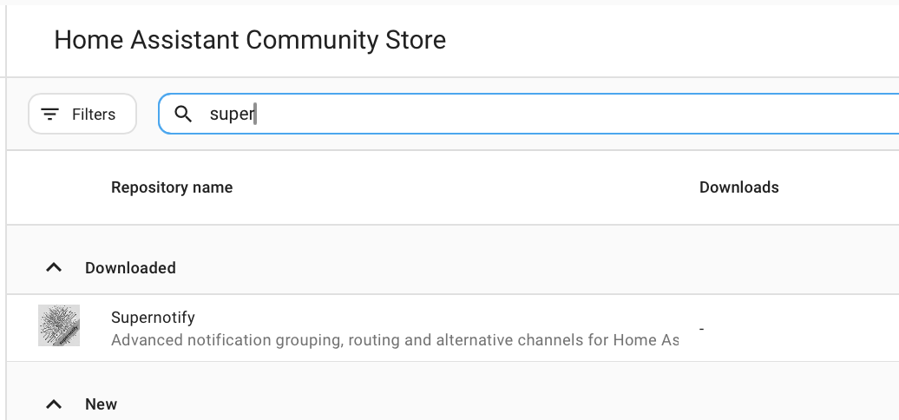
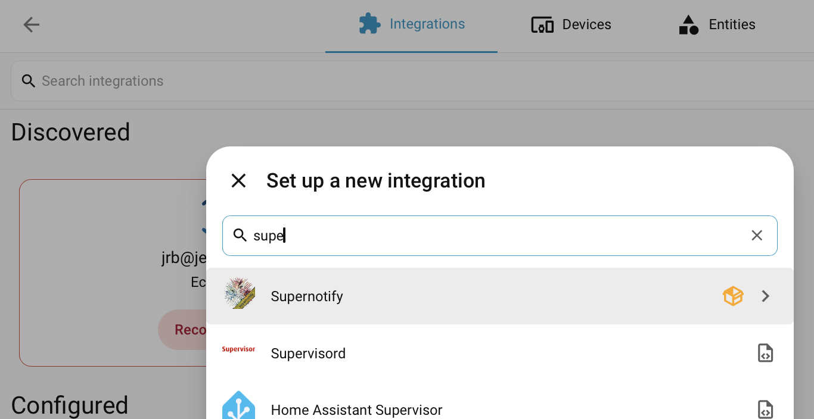

# Installazione

## Installare da HACS { #install-from-hacs }

Per prima cosa, assicurati di avere **HACS** installato.

In caso contrario, consulta le [istruzioni di HACS](https://hacs.xyz/docs/use/). Supernotify è uno dei repository predefiniti di HACS, quindi non serve configurare un repository personalizzato.

Nella pagina HACS di Home Assistant, seleziona **Supernotify** nell'elenco delle integrazioni disponibili, scaricalo e riavvia Home Assistant.

{width=400}

## Aggiungere l'integrazione { #add-the-integration }

Vai in **Impostazioni → Dispositivi e servizi → Aggiungi integrazione** e cerca **Supernotify**. Accetta i valori predefiniti.

## Rilevamento e valori predefiniti { #discovery-and-defaults }

Questo è tutto ciò che serve per far funzionare le prime notifiche.

Supernotify guarda cosa c'è già in Home Assistant e trova:

- **Persone** - chiunque abbia una *Persona* o un *Utente* in Home Assistant, con i telefoni e i tablet su cui usa l'app di Home Assistant
- **Modi per notificare** - notifiche push sul cellulare, un'integrazione e-mail SMTP esistente, tutte le entità notify e dispositivi come altoparlanti Alexa o campanelli, se li hai

Crea una *delivery* per ogni modo di notificare che trova, più alcune di comodo, come `chime_siren_all` e `alexa_devices_announce_all`, se hai quei dispositivi.

Archivio, rilevamento dei duplicati e impostazioni di manutenzione si possono modificare in seguito dall'opzione **Configura** dell'integrazione.

Ora [invia la tua prima notifica](first_notification.md).
