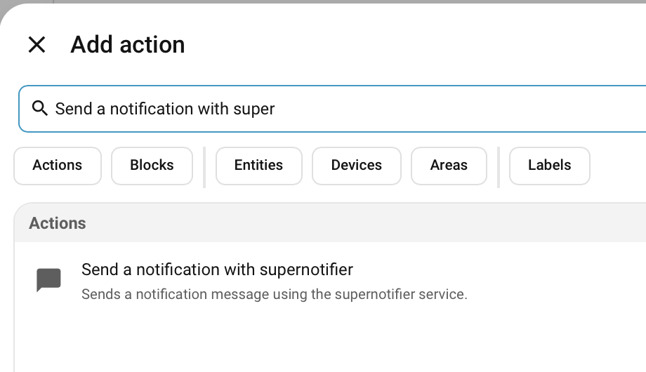
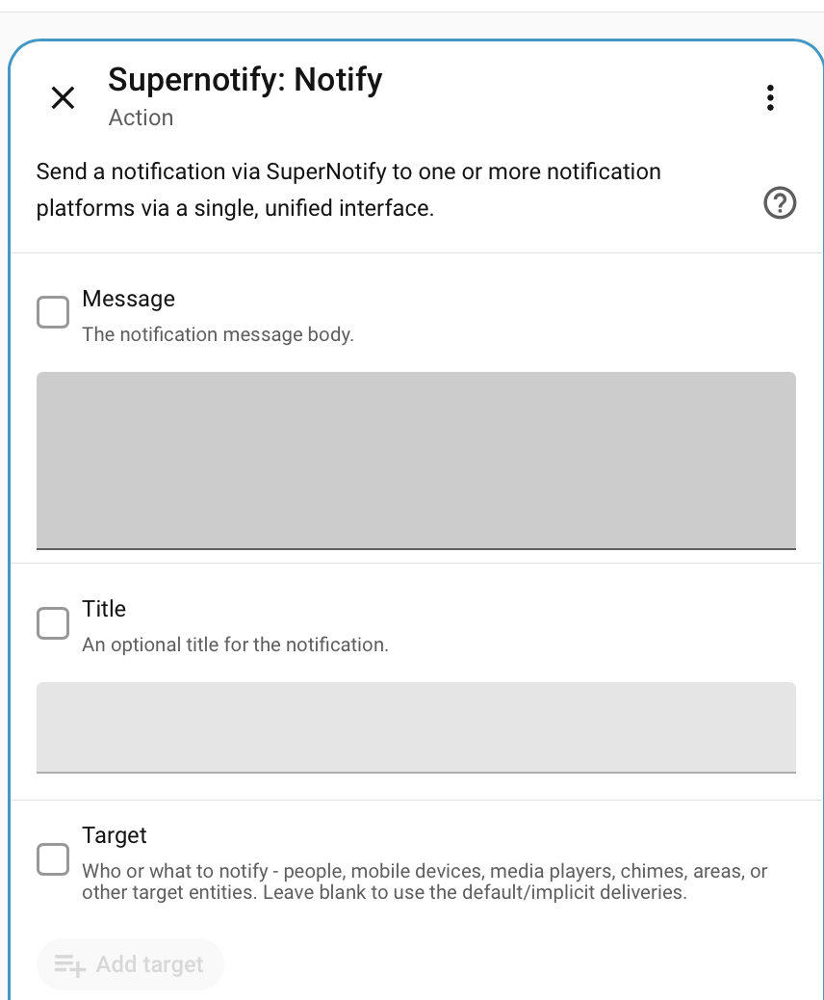
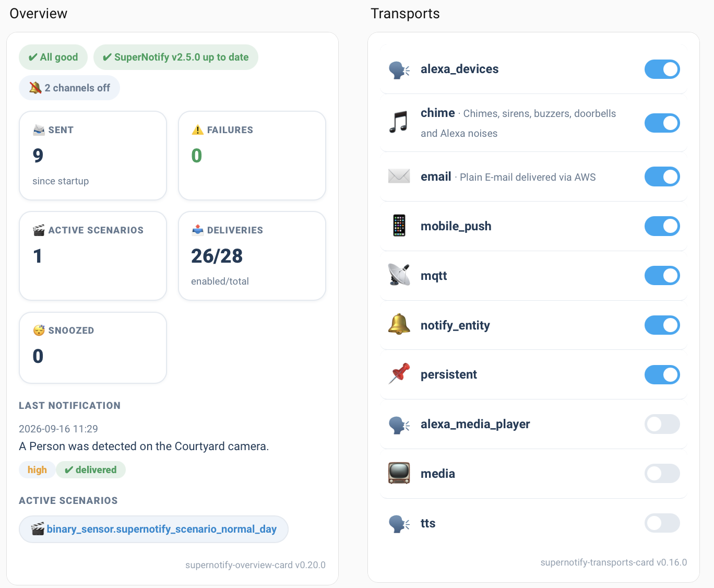

# Cosa fare dopo

Inizia da un'automazione, perché è a questo che servono le notifiche. Il resto è facoltativo e si può fare in qualsiasi ordine.

## Aggiungere una notifica a un'automazione { #add-a-notification-to-an-automation }

`supernotify.notify` è un'azione come le altre, quindi si inserisce in un'automazione nel modo consueto. Questo esempio invia una notifica quando scatta un sensore di movimento nel corridoio.

Crea un'automazione con il sensore di movimento come trigger, poi scegli **Aggiungi azione** e cerca Supernotify:

{width=600}

Compila il messaggio e qualsiasi altra cosa tu voglia dalla [tua prima notifica](first_notification.md), come una destinazione o una delivery:

{width=600}

```yaml title="Automazione con sensore di movimento"
alias: Hallway motion notification
triggers:
  - trigger: state
    entity_id: binary_sensor.hallway_motion
    to: "on"
actions:
  - action: supernotify.notify
    data:
      title: Motion detected
      message: Something is moving in the hallway
      target: person.john_mcdoe
```

Per sentirla anche dagli altoparlanti, aggiungi `alexa_devices_announce_all` e `mobile_push` come delivery. [Inviare notifiche](../../usage/notifying.md) descrive tutto il resto che l'azione può fare.

Per un esempio più completo, con annunci vocali e un'immagine della telecamera, vedi la ricetta [C'è qualcuno alla porta](../../recipes/someone_at_the_door.md).

## Aggiungere una dashboard { #add-a-dashboard }

[Supernotify Cards](https://github.com/lollox80/supernotify-cards) offre molte card dedicate per controllare e monitorare le notifiche, inviarle a mano o provare le configurazioni.



La pagina [Dashboard](../../configuration/dashboard.md) contiene un esempio completo da incollare in una nuova dashboard, che poi si può modificare visivamente.

## Attivare e disattivare persone e delivery { #switch-people-and-deliveries-on-and-off }

Ogni persona che Supernotify conosce ha un'entità `switch` in Home Assistant, e così ogni delivery. Spegnine una per non disturbare qualcuno, o per silenziare gli altoparlanti per un po', senza modificare alcuna automazione.

## Notificare solo alcuni dispositivi { #notify-just-some-devices }

Le destinazioni possono essere un'**Area**, un **Piano** o un'**Etichetta**, oltre a una persona o a un dispositivo, così una notifica può andare agli altoparlanti del piano terra, o a tutto ciò che ha l'etichetta della cucina. Vedi [Targets](../../usage/targets.md) e le [FAQ](../../faqs.md) per le domande più comuni.

## Regolare le impostazioni { #tune-the-settings }

Archiviazione, rilevamento dei duplicati e manutenzione si possono modificare dall'opzione **Configura** dell'integrazione, in **Impostazioni → Dispositivi e servizi**. Vedi [Archiviazione](../../configuration/archiving.md) e [Rilevamento dei duplicati](../../configuration/dupe_detection.md).

## Lasciati ispirare { #be-inspired }

Trovi molte idee con configurazioni di esempio nelle [ricette](../../recipes/index.md).

## Andare oltre con YAML { #go-further-with-yaml }

Con un po' di configurazione YAML si può fare di più, ed è tutto facoltativo:

- Dare alle persone un indirizzo e-mail o un numero di telefono, in [People](../../configuration/people.md)
- Creare le tue delivery, come un'e-mail HTML o un gruppo fisso di altoparlanti, in [Deliveries](../../configuration/deliveries.md)
- Cambiare il comportamento delle notifiche di notte, o quando non c'è nessuno in casa, con gli [scenario](../../configuration/scenarios.md)
- Allegare istantanee delle telecamere, in [Multimedia](../../configuration/multimedia.md)

[Concetti avanzati](advanced_concepts.md) spiega le idee che ci stanno dietro, e [Configurazione](../../configuration/index.md) è il riferimento.

## Ottenere aiuto { #get-help }

Chiedi nella pagina [Discussions](https://github.com/rhizomatics/supernotify/discussions), oppure usa un agente IA - vedi l'ultima risposta nelle [FAQ](../../faqs.md).
