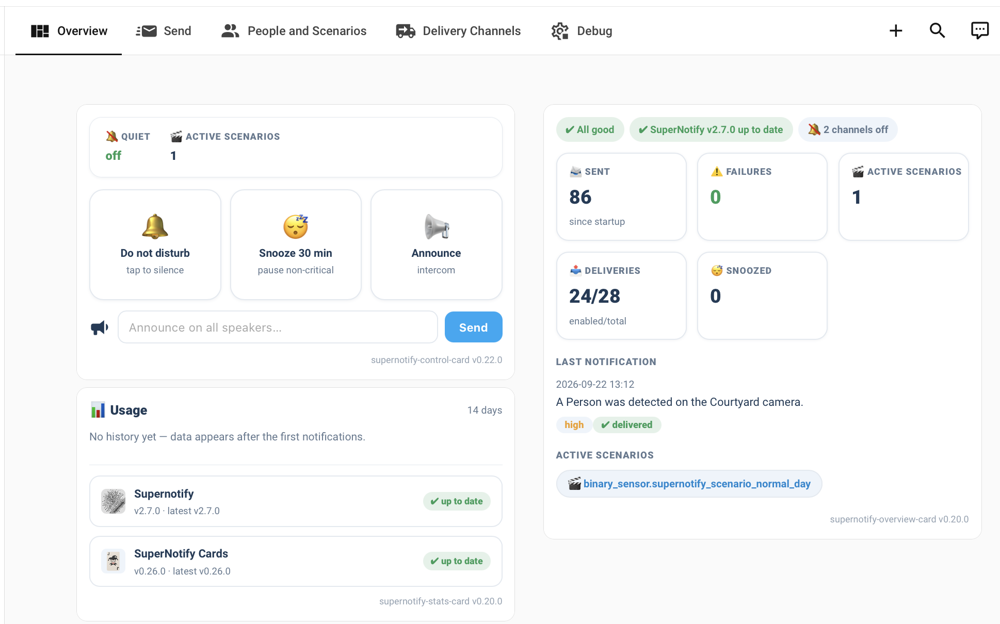
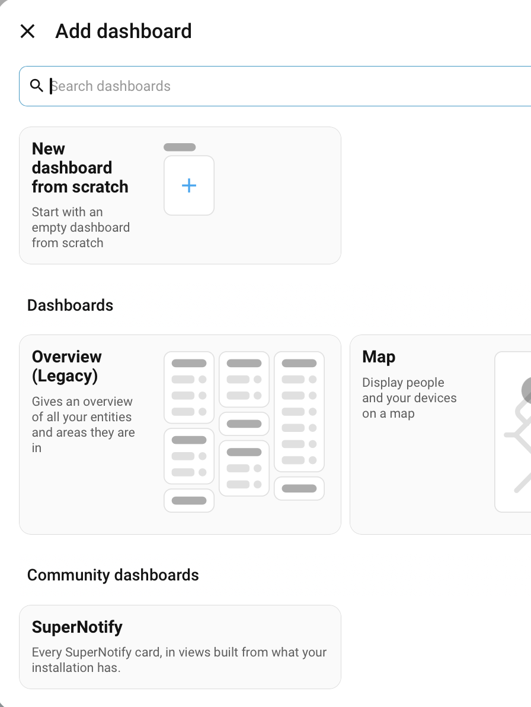

---
tags:
  - dashboard
  - recipe
  - ui
  - lovelace
  - supernotify_cards
title: Notification Dashboard
description: Send out notification and control notifications from a Home Assistant Dashboard
---
# Recipe - Dashboard

{width=600}

## Implementation

### Pre-built Dashboard

If you have Supernotify Cards already installed, go to **Settings | Dashboards** in Home Assistant, and click on **Add Dashboard**. The pre-built one will appear under *Community Dashboards*

{width=400}

### Custom YAML

Example YAML and instructions to create and tune your own dashboard are at [Dashboard Configuration](../configuration/dashboard.md)
