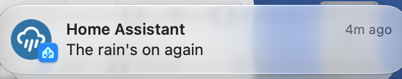

---
tags:
  - alert
  - scenario
  - notify_entity
  - mobile_push
  - wildcards
  - weather
  - recipe
title: Alert Quietly When it Rains
description: Use a Supernotify Scenario with its own notify entity and the Home Assistant Alert integration to send low priority mobile push notifications with a rain icon
---
# Recipe - Rain Alert

## Purpose

Get a quiet reminder on the phone while it's raining, repeated every hour until it stops, using Home Assistant's [Alert](https://www.home-assistant.io/integrations/alert/) integration.



## Implementation

An alert only gives a notifier a message and a title, so what kind of notification it becomes is set in a scenario. The scenario has a `notify_entity`, which gives it a `notify.its_raining_again` entity, and an action of the same name for the alert to list in its `notifiers`. See
[Scenario Notify Entity](../configuration/scenarios.md#notify-entity).

Everything the alert sends has the scenario applied, which makes the mobile push low priority and gives it a rain icon. Low priority is passed on to an iPhone as a `passive` notification, which doesn't light up the screen or make a sound.

## Example Configuration

```yaml title="supernotify.yaml"
scenarios:
  rain:
    alias: Its raining again
    notify_entity: its_raining_again
    delivery:
      mobile_push:
        data:
          priority: low
          notification_icon: mdi:weather-pouring
      .*:
        enabled: false
```

```yaml title="configuration.yaml"
alert:
  rain:
    name: Its raining again
    entity_id: binary_sensor.rain
    repeat: 60
    notifiers:
      - its_raining_again
```

`mobile_push` is the standard delivery Supernotify makes when there are phones with the Home Assistant app, so there's nothing more to configure for it.

### Why the `.*` is needed

A scenario doesn't replace the usual choice of deliveries, it adds to it and adjusts it. The alert names no deliveries, so without the last two lines the notification goes to every delivery that is included by default - email, chimes, Alexa or whatever else is set up - and the scenario only changes how the `mobile_push` one looks.

- `.*` is a pattern that matches the name of every delivery, and `enabled: false` switches off each one it matches, for this notification only.
- `mobile_push` is still sent, because a delivery listed by its own name always wins over a pattern that also matches it.

So the two together say "only mobile push". Other notifications are not affected, since the scenario is only applied to what is sent to `notify.its_raining_again`. See [Wildcard Deliveries](../configuration/scenarios.md#wildcard-deliveries) for more on patterns.

## Variations

- Add `done_message` to the alert to be told when the rain has stopped, which goes through the same scenario.
- Add more deliveries to the scenario by name, such as a chime, and they are sent too.
- The same notify entity works anywhere else that takes one, like an automation's `notify.send_message`.
