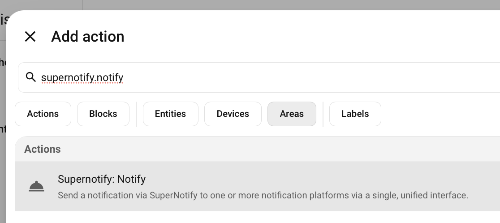
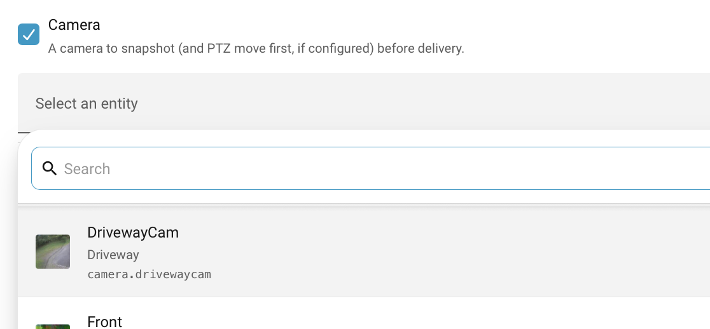

---
tags:
  - recipe
  - doorbell
  - alexa
  - voice_assistant
  - camera
  - mobile_push
  - chime
  - occupancy
  - zero_yaml_config
title: Someone's at the Door
description: Announce on the speakers when someone is at the door, then add a picture from the porch camera to phones, with chimes and e-mail or text when nobody is home
---
# Recipe - Someone's at the Door

## Purpose

Have the speakers say that someone is at the door, then add a picture from the porch camera for the phones. A good first automation after the [Quick Start](../quick_start/index.md), and the first two steps need no Supernotify configuration at all.

## Implementation

### Step 1 - Announce on the Speakers

Create an automation with the doorbell as its trigger, and a `supernotify.notify` action that uses a spoken delivery.

{width=600}

If you have Alexa Devices, the `alexa_devices_announce_all` delivery is already there. For other speakers, use a [TTS](../transports/tts.md) delivery.

```yaml title="Doorbell Automation"
alias: Someone at the door
triggers:
  - trigger: state
    entity_id: binary_sensor.front_doorbell
    to: "on"
actions:
  - action: supernotify.notify
    data:
      message: Someone is at the front door
      delivery: alexa_devices_announce_all
```

### Step 2 - Add a Picture from the Porch Camera

Use the *Camera* selector on the notification action to add the camera, and `mobile_push` to the deliveries.

{width=600}

If you were to edit the YAML for the automation, the action would look like:

```yaml title="Doorbell Action with Camera Snapshot"
  - action: supernotify.notify
    data:
      title: Front door
      message: Someone is at the front door
      media:
        camera_entity_id: camera.porch
      delivery:
        - alexa_devices_announce_all
        - mobile_push
```

Supernotify takes one snapshot from the camera and gives it to each delivery that can show a picture. The speakers still just say the message, and the phones show the picture with it.

Snapshots are stored for a while on the file system, so check the [Multimedia Basic Configuration](../configuration/multimedia.md#basic-configuration) if the picture doesn't arrive.

## Variations

### Chimes

Play a doorbell sound instead of, or as well as, the spoken announcement, on Alexa devices, sirens or cheap 433Mhz chimes. Set up a `doorbell` alias as shown in [Chime](../transports/chime.md#aliases), then ask for that tune:

```yaml
      delivery:
        - chime
        - mobile_push
      delivery_control:
        chime:
          data:
            chime_tune: doorbell
```

### E-mail or Text if Nobody is Home

A spoken announcement is no use to an empty house. Give the `email` and `sms` deliveries an `occupancy` of `all_out`, so they are only used when everyone is out:

```yaml title="Supernotify Config Snippet"
transports:
  email:
    delivery_defaults:
      occupancy: all_out
  sms:
    delivery_defaults:
      occupancy: all_out
```

Then add `email` and `sms` to the deliveries in the action. The e-mail has the camera picture attached.

This needs an e-mail address or phone number for each person, see [People](../configuration/people.md), and for texts one of the [SMS](../transports/sms.md) integrations.

### Don't Announce to an Empty House

Set **Spoken delivery occupancy** to `only_in` in the integration's **Configure** option, under **Delivery Control**, so the speakers stay quiet when nobody is home. See [Delivery Control](../configuration/deliveries.md#delivery-control).

### Only Some Speakers

Leave out `alexa_devices_announce_all`, use the `alexa_devices` delivery, and choose the speakers as targets, by entity, area, floor or label. See [Targets](../usage/targets.md).

### Move the Camera First

If the porch camera can pan, tilt or zoom, have it [move to the door before the snapshot](move_a_camera_for_snapshot.md).

## Further Reading

* [Alexa Devices Transport](../transports/alexa_devices.md)
* [Mobile Push Transport](../transports/mobile_push.md)
* [Home Alone](home_alone.md), for changing notifications by who is home
