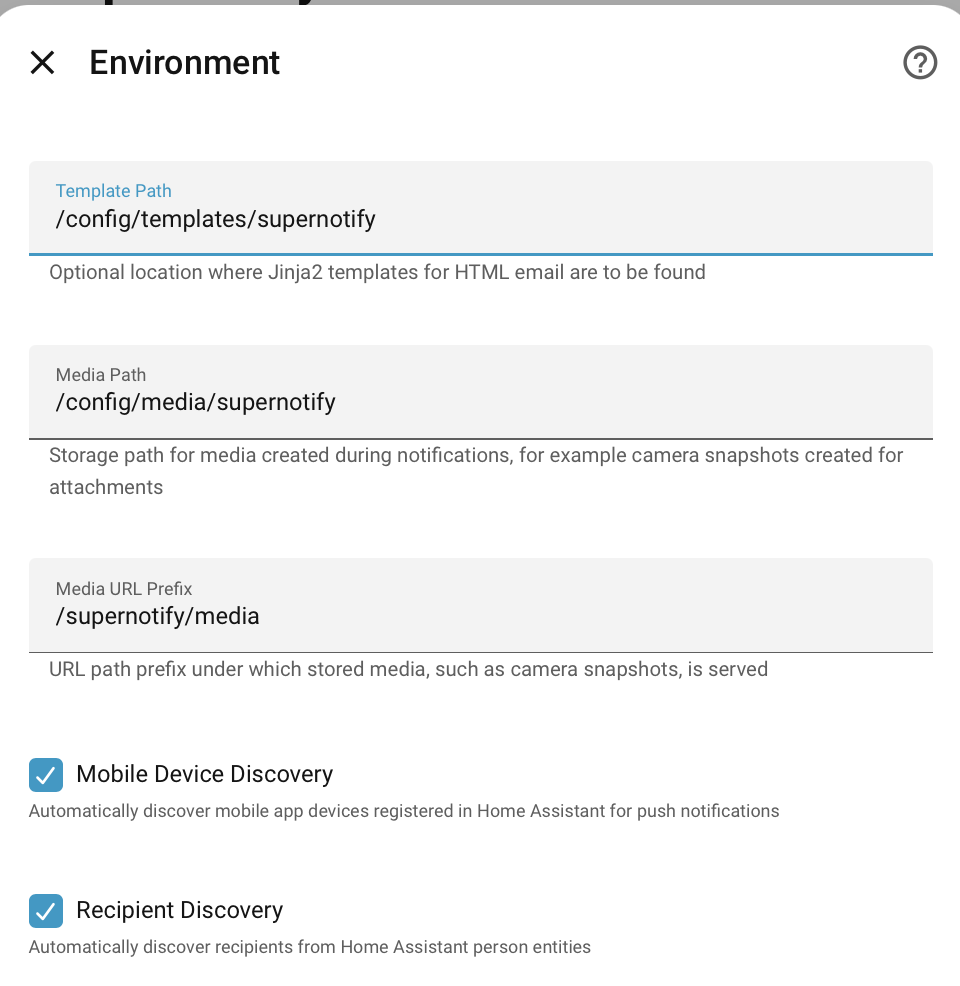

---
tags:
  - transport
  - email
  - smtp
  - html_email
---
# Email Transport Adaptor

| Transport ID | Source                                                                                                                                | Requirements | Optional                                                                                                                                                                                                     |
|--------------|---------------------------------------------------------------------------------------------------------------------------------------|--------------|--------------------------------------------------------------------------------------------------------------------------------------------------------------------------------------------------------------|
| `email`      | :material-github:[`email.py`](https://github.com/rhizomatics/supernotify/blob/main/custom_components/supernotify/transports/email.py) | -            | :material-home-assistant: [SMTP Integration](https://www.home-assistant.io/integrations/smtp/), :material-home-assistant: [Google Mail Integration](https://www.home-assistant.io/integrations/google_mail/) |


Can be used for plain or HTML template emails, and handle images as attachments or embedded HTML. Automatically configured if there's already an SMTP integration.

!!! note
    The Home Assistant [SMTP](https://www.home-assistant.io/integrations/smtp/) integration for e-mail doesn't allow priority to be set.

## Pre-generated HTML

The `data` section of the notification can have a `message_html` supplied for html that will be used in place of the standard `message` for HTML emails and ignored for other notification types. This does not require templates, see the [Restart Email Recipe](../recipes/restart_email.md) for a simple example. In this case, HTML will automatically be tagged onto the end to include any attached images. The `data` can be configured as part of the fixed configuration, or in the `data` of the action call.

## HTML Templates

HTML templates use the standard Home Assistant Jinja2 [Templating](https://www.home-assistant.io/docs/configuration/templating) with access to entity states, additional filters etc.

Padding to nudge e-mail clients from reading too deeply into the e-mail for in-box summaries can be tuned with `preheader_blank` and `preheader_length` configuration in the transport `options`. The other useful option is `strict_template` to switch on or off the stricter
Jinja2 template validation.

### Configuration

Supernotify ships with a built in template, `default.html.j2` which can be used by using `template: default.html.j2` in the `data` section. This shouldn't be edited directly, since changes will get overwritten by future releases. Instead, write your own, or amended versions of [`default.html.j2`](https://github.com/rhizomatics/supernotify/blob/main/custom_components/supernotify/default_templates/email/default.html.j2) and put
it into a custom template directory, usually inside Home Assistant's `\config` directory. Templates can live in this directory, or in an `email` subdirectory ( the top-level is for templates that could be used with any transport, and `email` only for this one).



### Template Variables

Supernotify also adds an `alert` variable for context of the current notification, with these values:

| Attribute         | Description                                                                                |
|-------------------|--------------------------------------------------------------------------------------------|
| message           | Notification message                                                                       |
| title             | Notification title                                                                         |
| preheader         | Invisible `div` contents at top of html used to show info below heading                    |
| priority          | Notification priority                                                                      |
| envelope          | Delivery Envelope (complex nested object)                                                  |
| subheading        | Defaults to "Home Assistant Notification"                                                  |
| server            | Access to `name`,`language`,`internal_url` and `external_url` of this HomeAssistant server |
| preformatted_html | HTML supplied to the notify action, for example by an Automation                           |
| action_url        | Action URL for mobile action                                                               |
| action_url_title  | Title for the Action URL                                                                   |
| img               | Snapshot image attachment, with `url` and `desc` fields                                    |

The `preheader` defaults to a minimum 100 characters packed with `&#847;&zwnj;&nbsp;` to force e-mail clients
not to dig into the message contents when showing a preview in the in-box.

### Image Attachments

Where the image is snapped rather than being only a URL, it will be included as an attachment and
an `cid:XXXX` URL generated to point to the attachment name.

!!! info
    The additional `data` options for Google Mail (`cc`,`bcc`,`from`) are not yet supported.

## Default Delivery

A default Delivery called `DEFAULT_email` will be automatically generated for Email transport if no explicit ones created, using the first available SMTP integration if one is present. If you don't want to use it, then use configuration as below, or configure your own delivery for the transport.

```yaml
transports:
  email:
    disabled: false
```

## Direct Connection

### Rationale

Setting the `OPTION_MODE` option to `direct` on a delivery switches it from calling an HA notify action to sending over its own SMTP connection instead (the default option is `ha_smtp` for the Home Assistant built-in SMTP integration). This can be set at transport level or at delivery level (if you have multiple email deliveries, such as HTML and plain).

```yaml
transports:
    delivery_defaults:
      options:
        mode: direct
        sender: hass@mail.barrsofcloak.org
        sender_name: Home Assistant
```

This avoids using the built in [Home Assistant SMTP Integration](https://www.home-assistant.io/integrations/smtp/), with the same functionality except no overhead of pre-registering email addresses, introduced in mid-2026 Home Assistant as part of the Notify Entity integration.

In addition to reverting to the previous simpler Home Assistant usage, it also offers:

#### Priority

Envelope priority is mapped to common header fields used for internet mail:

- Priority
- Importance
- X-Priority
- X-MSMail-Priority

#### Message-ID

`Message-Id` in email header ties back to notification ID and delivery name. (Your mail relay may override this).

### Example Config

Connections default to `STARTTLS` over port 587, though can be changed to other ports or without encryption. This will work with Amazon SES, local mail relays etc.

`connection` is only used by deliveries that set `mode: direct` - other `email` deliveries on the same transport can still go via an `action` as normal.

```yaml
transports:
  email:
    connection:
      host: smtp.local.net
      port: 587
      encryption: starttls
      username: postie
      password: blackandwhitecat
      verify_ssl: false
    delivery_defaults:
      options:
        sender: hass@local.net
        sender_name: Your Friendly Home Assistant
        default_title: Home Assistant Notification

delivery:
  direct_mail:
    transport: email
    options:
      mode: direct
    target: mailarchive@mymail.com
```

In addition, all of the other `email` options are available, such as for tuning PNG attachments or preheaders for message previews.

### Reusing the Home Assistant SMTP Integration Configuration

If no `connection` block is configured, this transport falls back to the connection details (server, port, encryption, username, password, `verify_ssl`, sender, sender name) from a configured [SMTP Integration](https://www.home-assistant.io/integrations/smtp/) config entry, so you don't have to duplicate credentials. This only applies to ConfigFlow (UI) based SMTP integration setups, not the legacy YAML `platform: smtp` style. Omit `connection` entirely to use this.


### Roadmap

Initially this only preserves the original easier to use functionality of Home Assistant SMTP prior to the enforcement of pre-registering every e-mail address as an `entity`, and mapping envelope priority to common headers.

It is anticipated that this will also open up more features, such as modern email features like DKIM.


## Reference

### Home Assistant Core
- [SMTP Integration](https://www.home-assistant.io/integrations/smtp/)
    - [Open Issues](https://github.com/home-assistant/core/issues?q=is%3Aissue%20label%3A%22integration%3A%20smtp%22%20state%3Aopen)
- [Templating](https://www.home-assistant.io/docs/configuration/templating/)
### Home Assistant Other
- [Mastering Dynamic HTML Email Alerts in Home Assistant: Secure SMTP & Custom Content](https://newerest.space/home-assistant-dynamic-html-email-alerts-secure-smtp-custom-content/)
### General
- [MailChimp HTML Email Template Guide](https://templates.mailchimp.com)
- [Jinja2 Template Designer Documentation](https://jinja.palletsprojects.com/en/stable/templates/)
