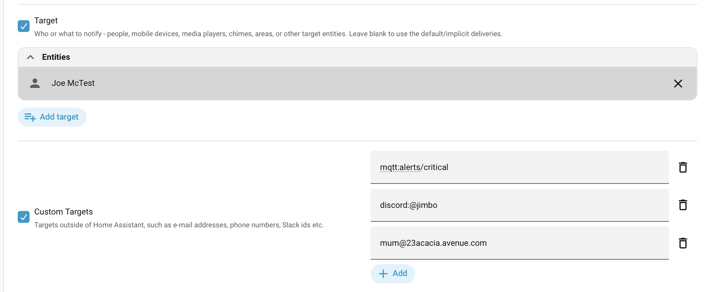

# Targets

Home Assistant notifications use *target* for any address used in a notification - that could be an e-mail address, a phone number for SMS, a Slack/Discord/Telegram ID, a smart speaker or any of the new-style Notify Entities.

Supernotify has the ability to take a big, mixed bag of targets and send off the right notification for that target, and lets you associate targets with people, using the *Recipient* config, so you can pick a person and that automatically gets their e-mail address or mobile app name for push alerts.

{width=400}

## Target Categories

A **Target Category** is used to identify what kind of target it is, and how to use it. Some categories are used by multiple transports, Entity ID for Notify Entity or Media Players, and others are unique to some transports, like `discord_channel`, `matrix_room` or `topic`.

Targets will be auto-categorized wherever possible, and can also be explicitly categorized.

## Categorizing Targets

There are two ways Supernotify identifies targets, whether in a notification call, or pre-set in the configuration:

- **Automatically Matched** - it does this where there's a clear and obvious format for a target, such as a phone number, e-mail address or Home Assistant entity ID.
- **Qualified Targets** - this works for any target, including those that can be automatically matched. Targets either have a *prefix* or are defined in a mapping.

## Available Categories

Only the ones marked `N` for *Auto* ever needed a prefix, since the others will be automatically detected.

| Category          | Auto | Transports |
| ----------------- | ---- | ---------- |
| `entity_id`       | Y    | Alexa Devices, Alexa Media Player, Chime, HTML5, Kodi, Media Player, Notify Entity, TTS |
| `device_id`       | Y    | Chime      |
| `email`           | Y    | Email      |
| `mobile_app_id`   | Y    | Mobile Push, TTS |
| `phone`           | Y    | SMS        |
| `topic`           | N    | MQTT       |
| `discord_channel` | N    | Discord    |
| `matrix_room`     | N    | Matrix     |


### Automatic Matches

The following categories can be automatically detected:

- Email
- Phone
- Home Assistant Device
- Home Assistant Entity
- Home Assistant Mobile App


#### Notify Entity

*Notify Entities* are the newer way of integrating notifications into Home Assistant. A Notify Entity could be one of many things - an e-mail, an MQTT topic, a file on the disk, a HTML5 browser, an Alexa device, or a group of notify entiries.

All of these can be handled by the `notify_entity` integration. However, the `send_message` action for Notify Entity is **very** limited, so often there's a second action offered by the platform itself to offer the full range of options. For example, `html5.send_message` or `ntfy.publish`. The `alexa_devices` integration does use the standard `send_message` call, however since it knows about Alexa, it can craft that message by for example simplifying the text and stripping out URLs so announcements don't come out weird.

Supernotify uses the `domain` of each Notify Entity to work out if it can be better handled by a dedicated transport, and then if not, falls back to the plain vanilla `notify_entity`. You don't need to do anything special for target selection for this, though if you don't like it, it can be tuned or switched off.


### Qualified Targets

There are 3 ways to do this, to suit different styles of use.

#### Category Prefixes

A *Target Category* name is prefixed onto the target, for example `topic:my_topic_name` or `discord_channel:@userid`. This can be used anywhere a target is requested and wouldn't get auto-detected:

```yaml title="single target"
  - action: supernotify.notify
    data:
        message: Something went off in the basement
        target: discord_channel:0987654321
```

```yaml title="mix of targets"
  - action: supernotify.notify
    data:
        message: Something went off in the basement
        target:
         - discord_channel:0987654321
         - jjh@34acacia.avenue.com
         - topic:devices/sirens
         - notify.alexa_kitchen_announce
```

#### Category Mapping for Target

This is a more precise way of specifying targets, in that it doesn't try to look for prefixes or otherwise mess with the target value.

```yaml title="mix of targets"
  - action: supernotify.notify
    data:
        message: Something went off in the basement
        target:
            discord_channel: 0987654321
            email:
             - jjh@34acacia.avenue.com
             - bigdave@34acacia.avenue.com
            entity_id: notify.alexa_kitchen_announce
            topic: devices/switches/sirens
```

This style is also useful if for some reason the category prefixes cause problems, for example if the real address begins with something like `topic:`, since in this case the target address is exactly what's specified.


#### Target Defined within Delivery

This is a much wordier style if using only for targets, but becomes more practical if target is one of several things being configured for deliveries.

It's also useful if you want to micro-manage which targets of the same category go to different deliveries, in this example some emails going as plain and others as HTML templated email.

```yaml title="mix of targets"
  - action: supernotify.notify
    data:
        message: Something went off in the basement
        delivery:
            discord:
                target: 0987654321
            plain_email:
                target: jjh@34acacia.avenue.com
            html_email:
                target: bigdave@34acacia.avenue.com
            alexa_devices:
                target: notify.alexa_kitchen_announce
```

This style is also more likely to make sense when used for configuration, rather than have all that detail in multiple automation actions. See [Scenarios](./scenarios.md) for more on how to use these pre-canned bits of config.

```yaml title="mix of targets"
scenarios:
  red_alert:
      delivery:
        sms:
          target:
            - +4493932323200
            - +4403049939390
        alexa_devices:
          target:
            - group.all_alexas
      media:
        camera_entity_id: camera.porch
```

## Not All Transports Have Targets

Also worth noting that some transports don't have targets at all, like the Persistent one. There's a handy table in the Developer documentation, [Transport Configuration](../developer/transports.md)
