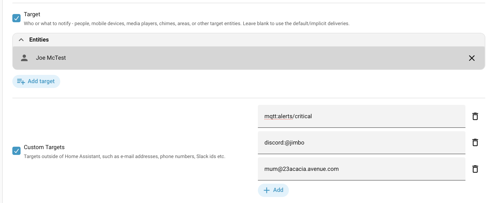
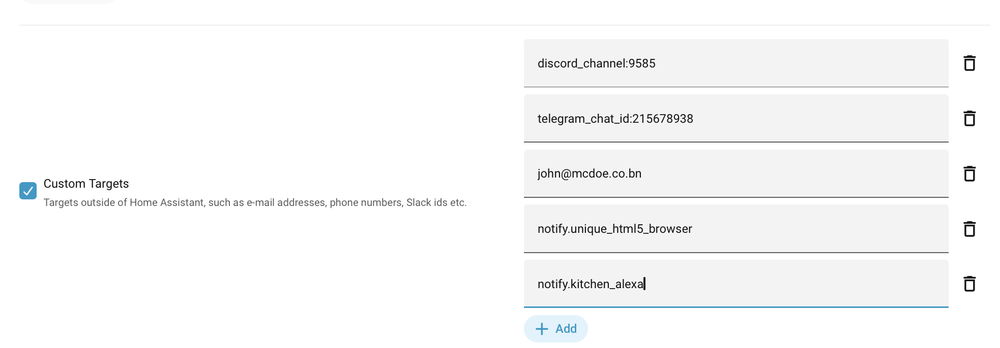

# Targets

Home Assistant notifications use *target* for any address used in a notification - that could be an e-mail address, a phone number for SMS, a Slack/Discord/Telegram ID, a smart speaker or any of the new-style Notify Entities.

Supernotify has the ability to take a big, mixed bag of targets and send off the right notification for that target, and lets you associate targets with people, using the *Recipient* config, so you can pick a person and that automatically gets their e-mail address or mobile app name for push alerts.

{width=400}

## Default Targets

If no `target` is specified on the action call, a default list will be used based on all the recipients configured or auto-discovered. This usually means everyone with a Home Assistant app on their phone or other device gets a mobile push notification.

Choosing any explicit targets switches this defaulting off. Targets can be re-added manually where needed, and there's a shortcut in the Home Assistant target UI where you choose the Supernotify **Device** and this will be read as switching back on those "out of the box" targets.

## Target Categories

A **Target Category** identifies what kind of target it is, and how to use it. Some categories are used by multiple transports, like `entity_id` for Notify Entities or Media Players, and others are unique to one transport, like `discord_channel`, `matrix_room` or `topic`.

Categories marked *Auto* are recognized from the format of the target itself. The others need to be qualified with a [prefix](#category-prefixes) or given in a [mapping](#category-mapping).

| Category                          | Auto | Used By |
| --------------------------------- | ---- | ------- |
| `entity_id`                       | Y    | Alexa Devices, Alexa Media Player, Chime, HTML5, Kodi, Media Player, Notify Entity, TTS |
| `device_id`                       | Y    | Chime   |
| `email`                           | Y    | Email   |
| `mobile_app_id`                   | Y    | Mobile Push, TTS |
| `phone`                           | Y    | SMS     |
| `person_id`                       | Y    | Expanded to that person's targets, from their *Recipient* config |
| `area_id`, `floor_id`, `label_id` | N    | Expanded to the entities in them |
| `topic`                           | N    | MQTT    |
| `discord_channel`                 | N    | Discord |
| `matrix_room`                     | N    | Matrix  |
| `telegram_chat_id`                | N    | Telegram |

### Notify Entity

*Notify Entities* are the newer way of integrating notifications into Home Assistant. A Notify Entity could be one of many things - an e-mail, an MQTT topic, a file on the disk, a HTML5 browser, an Alexa device, or a group of notify entities.

All of these can be handled by the `notify_entity` integration. However, the `send_message` action for Notify Entity is **very** limited, so often there's a second action offered by the platform itself to offer the full range of options. For example, `html5.send_message` or `ntfy.publish`. The `alexa_devices` integration does use the standard `send_message` call, however since it knows about Alexa, it can craft that message by for example simplifying the text and stripping out URLs so announcements don't come out weird.

Supernotify uses the `domain` of each Notify Entity to work out if it can be better handled by a dedicated transport, and then if not, falls back to the plain vanilla `notify_entity`. You don't need to do anything special for target selection for this, though if you don't like it, it can be tuned or switched off.

### Area, Floor and Label Targets

Home Assistant's standard target selectors can be used as well as addresses and entities, so a notification can go to "whatever is in the kitchen" or "everything labelled `chime`", using the same `area_id`, `floor_id` and `label_id` keys as any other Home Assistant action:

```yaml
  - action: supernotify.notify
    data:
        message: Dinner is ready
        target:
            area_id: kitchen
            floor_id: ground_floor
            label_id:
              - chime
```

Supernotify resolves them to entities itself, using the same core logic as Home Assistant actions, and then applies each delivery's usual target selection to those entities. An entity in more than one of them - in the kitchen, on the ground floor and labelled `chime` - is kept just once, and a transport never sees a selector. Unknown areas, floors or labels are logged as a warning rather than silently resolving to nothing.

An action that genuinely knows about areas itself, rather than about the entities in them, takes the `area_id` in its own `extra_data` rather than as a target.

## Simple Targeting

Simple targeting is a single value, or a big mixed list, that Supernotify sorts out itself. Anything in an *Auto* category is recognized from its format, and everything else gets a category prefix.

It's quick, and fine for most notifications, but Supernotify is making the decisions. A target goes to every delivery that can use it, and a value with no recognizable format and no prefix is ignored. When that isn't what you want, use [Precise Targeting](#precise-targeting).

### Category Prefixes

A *Target Category* name is prefixed onto the target, for example `topic:my_topic_name` or `discord_channel:@userid`. This can be used anywhere a target is requested and wouldn't get auto-detected:

```yaml title="single target"
  - action: supernotify.notify
    data:
        message: Something went off in the basement
        target: discord_channel:0987654321
```

```yaml title="mix of targets"
  - action: supernotify.notify
    data:
        message: Something went off in the basement
        target:
            - discord_channel:0987654321
            - jjh@34acacia.avenue.com
            - topic:devices/sirens
            - matrix_room:!uniqueroom:example.org
            - telegram_chat_id:215678938
            - notify.alexa_kitchen_announce
```

Only target categories work as prefixes. Transport and delivery names only work as [mapping](#category-mapping) keys.

In the Home Assistant Actions UI, the **Custom Targets** section can be used to add in anything you like. This is in addition to the regular targets, so for things like `notify` entities, it's easier using that selector, or choosing them by area, floor or label.



## Precise Targeting

Precise targeting says exactly what each target is, or exactly which delivery it's for, so nothing is left to guesswork.

### Category Mapping

This is a more precise way of specifying targets, since the values are used exactly as given, with no prefix parsing. It's useful if an address happens to start with something like `topic:`.

```yaml title="mix of targets"
  - action: supernotify.notify
    data:
        message: Something went off in the basement
        target:
            discord_channel: 0987654321
            email:
              - jjh@34acacia.avenue.com
              - bigdave@34acacia.avenue.com
            entity_id: notify.alexa_kitchen_announce
            topic: devices/switches/sirens
```

A key doesn't have to be a target category. It can also be:

- a **transport name**, such as `sms`, which reaches every delivery using that transport
- a **delivery name**, such as `html_email`, which reaches only that delivery

```yaml title="an extra address for one delivery"
  - action: supernotify.notify
    data:
        message: Something went off in the basement
        target:
            email: jjh@34acacia.avenue.com
            html_email: bigdave@34acacia.avenue.com
```

Here `jjh` gets both the plain and the HTML email, and `bigdave` gets only the HTML one. `email` is a category here, so it reaches every delivery that takes email addresses, `html_email` included.

!!! note "Yes, this is a bit of a mixed bag"
    Mapping keys can be target categories, transport names or delivery names, and some names, like `email`, are more than one of these at once. It isn't the tidiest design. It was a deliberate trade-off to make `target` as flexible and quick to write as possible, but it can make it hard to see at a glance where a target will end up. If you want to be sure, use the more formal structure in the [next section](#target-defined-within-delivery), which always works.

### Target Defined within Delivery

Targets set inside a delivery in the `delivery` section go only to that delivery, and replace anything else it would have picked up. This is the way to give deliveries of the same kind completely separate addresses:

```yaml title="separate addresses per delivery"
  - action: supernotify.notify
    data:
        message: Something went off in the basement
        delivery:
            email:
                target: jjh@34acacia.avenue.com
            html_email:
                target: bigdave@34acacia.avenue.com
            discord:
                target: 0987654321
            alexa_devices:
                target: notify.alexa_kitchen_announce
```

It's wordier than a plain `target`, but it's the same structure used to tune everything else about a delivery, so it's worth using when you're setting more than just the target. It also tends to fit better in configuration than in automation actions. See [Scenarios](../configuration/scenarios.md) for how to use these pre-set bits of config.

```yaml title="targets in a scenario"
scenarios:
  red_alert:
      delivery:
        sms:
          target:
            - +4493932323200
            - +4403049939390
        alexa_devices:
          target:
            - group.all_alexas
      media:
        camera_entity_id: camera.porch
```

## Targets in Delivery Configuration

A delivery can also have its own `target` in its configuration, or inherit one from the `delivery_defaults` of its transport. This is separate from the targets on the notification, and the delivery's `target_usage` option decides what happens when there are both.

| `target_usage`   | When the delivery's own targets are used                                    | Targets on the notification |
| ---------------- | --------------------------------------------------------------------------- | --------------------------- |
| `no_action`      | Only when the action call has no `target` at all. This is the default       | Used                        |
| `no_delivery`    | Only when none of the notification's targets are usable by this delivery    | Used                        |
| `merge_delivery` | Added, but only when the notification already has a target for this delivery | Used                        |
| `merge_always`   | Always added                                                                | Used                        |
| `fixed`          | Always, and nothing else                                                    | Ignored                     |

"Targets on the notification" covers everything that isn't the delivery's own: the `target` on the action call, the people it names, and the default recipients used when there's no `target`.

The difference between `no_action` and `no_delivery` shows up when the notification has targets, but none this delivery can use. Here the action call has only an email address, so with the default `no_action` the siren delivery gets no target, and `no_delivery` lets it fall back to its own:

```yaml title="configuration"
delivery:
  hall_siren:
    transport: chime
    target: siren.hall
    target_usage: no_delivery
```

```yaml title="action call"
  - action: supernotify.notify
    data:
        message: Something went off in the basement
        target: jjh@34acacia.avenue.com
```

Similarly, `merge_delivery` only adds to a delivery that was already going to send, which suits a copy address on an email, while `merge_always` will make the delivery send even if it had nothing else to send to. Use `fixed` when the delivery should reach the same targets whatever is on the notification, including when a person is targeted.

See [Controlling Targets](../configuration/deliveries.md#controlling-targets) for the related `target_required` option, and the [Fixed Targets](../recipes/fixed_targets.md) and [Email CC](../recipes/email_cc.md) recipes for worked examples.

## Debugging

In the archived JSON, each delivery has an `envelope` with the targets assigned to it.
There's also a field `uncategorized_targets` that lists ones that couldn't be understood and were ignored, and a field `unassigned_targets` for those that could be categorized but didn't get selected by a delivery.

## Not All Transports Have Targets

Also worth noting that some transports don't have targets at all, like the Persistent one. There's a handy table in the Developer documentation, [Transport Configuration](../reference/transports.md)
