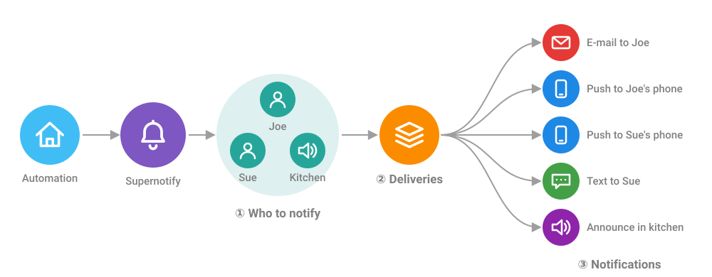

# 基本概念

## 整体如何协作 { #how-it-fits-together }

一条来自自动化的通知可以变成多条不同的通知，每一条都根据其发送方式进行调整。

把图从左到右看：

1. **通知谁** - 即[目标](#target)。根据 [recipient](#recipient) 信息，把人转换为可以联系到他们的方式
2. **Delivery** - 选出适用的 [delivery](#delivery)，可以是默认的，也可以是你指定的
3. **通知** - 每个 delivery 取出它能使用的目标，并发送适合它的通知，这样电子邮件可以使用带图片的完整 HTML 版式，而厨房音箱则收到一段简短的语音消息

在只使用界面的情况下，三个词几乎涵盖了一切。

## 目标 (Target) { #target }

目标就是**通知谁或通知什么**：一个人、一部手机、一个音箱、一个电子邮件地址，或者代表多个设备的区域、楼层或标签。

不指定目标时，通知会发给所有人。

## 接收人 (Recipient) { #recipient }

recipient 是 **Supernotify 所了解的一个人**：他的手机和平板，以及可选的电子邮件地址和电话号码。recipient 会根据 Home Assistant 中的 *Person* 实体自动找到。

recipient 并不是另一种目标。人是目标可以取的值之一，而 recipient 是 Supernotify 查找如何联系这个人的地方。这就是为什么 `person.joe_mctest` 可以用作目标，而不需要在每个自动化里都写上 Joe 的电子邮件地址。

## 投递 (Delivery) { #delivery }

delivery 是**发送通知的一种方式**，带有一个名称，例如 `mobile_push`、`email` 或 `alexa_devices_announce_all`。Supernotify 会为它在你的 Home Assistant 中找到的内容创建 delivery，它们就是 `supernotify.notify` 动作的 **Delivery** 框中显示的选项。

不指定 delivery 时，Supernotify 会使用那些能够自行判断发往何处的 delivery，例如移动推送和电子邮件。

## 优先级 (Priority) { #priority }

优先级表示**一条通知有多紧急**，分为五级：`minimum`、`low`、`medium`、`high` 和 `critical`。它是可选的，不指定时为 `medium`。优先级会传递给手机、电子邮件程序以及其他能够理解它的对象。

## 另外两个，以后再说 { #two-more-for-later }

它们在文档中随处可见，但入门时都用不到。

- **transport** 是 delivery 背后的技术手段，通常是一个 Home Assistant 集成，例如移动应用、SMTP 或 Alexa Devices。delivery 是 transport 加上与之配合使用的设置，因此一个 transport 可以有多个 delivery，例如普通的 `email` 和 `html_email`。
- **scenario** 是一组带名称的设置，用来改变使用哪些 delivery 以及它们的行为，例如夜间更安静。scenario 通过 YAML 设置。

[进阶概念](advanced_concepts.md)介绍了这两者，以及 YAML 配置能做的其他事情。
